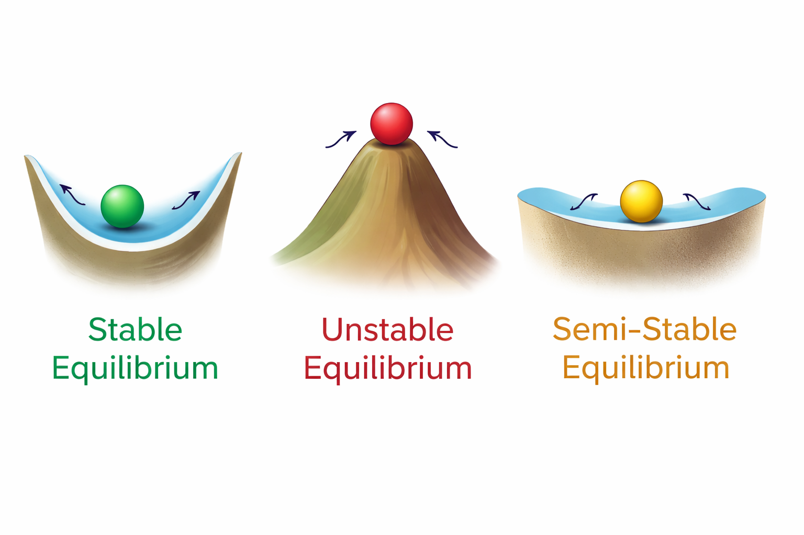

# Chapter: Differential Equations — Modeling Change Over Time

Throughout QSci 291 and 292, calculus has told a single story about change.

First, we studied **derivatives**. A derivative measures a *rate* — how fast something is changing at a particular moment.

- How fast is a population growing?
- How quickly is temperature rising?
- How rapidly is carbon being absorbed by a forest?

> A derivative answers: *What is happening right now?*    

Then we studied **integrals**. An integral accumulates small changes over time or space.

- How much total water flowed through a river this week?
- How much carbon was stored in a wetland over a decade?
- How much heat energy entered the ocean during a season?

> An integral answers: *What happened overall?*

Now we take the next logical step.

A **differential equation** connects these two ideas.  
Instead of being given a function and asked to differentiate or integrate it, we are given information about how a quantity changes — and asked to determine the function itself.

In other words:

- A derivative tells us the rate.
- An integral accumulates the rate.
- A differential equation describes how the rate depends on the system itself.

---

## An Environmental Example: Lake Pollution

Imagine a lake with pollutant concentration \( P(t) \) measured in kilograms.

Suppose field data suggests:

- The pollutant breaks down naturally.
- The rate of breakdown is proportional to how much pollutant is present.

That statement translates mathematically into:

\[
\frac{dP}{dt} = -kP
\]

This is not just a derivative. It is a **relationship between the rate of change and the quantity itself**. We are not given \( P(t) \). Instead, we are told how it changes.

To understand the long-term behavior of the lake, whether pollution disappears, stabilizes, or grows; we must solve this relationship. That relationship is a **differential equation**.

This is the final conceptual step in calculus:

- We measure change.
- We accumulate change.
- We model how change unfolds.

Differential equations allow us to describe entire systems — ecosystems, climate processes, chemical reactions, population dynamics — using the language of calculus.

> Instead of analyzing change, we now **build models of change**.


```{r, echo=FALSE, warning=FALSE, message=FALSE}
library(tidyverse)

# Decay constant
k <- 0.3

# Time sequence
t <- seq(0, 15, length.out = 400)

# Initial conditions
P0_values <- c(10, 25, 50, 100)

# Create data
df <- expand_grid(t = t, P0 = P0_values) |>
  mutate(P = P0 * exp(-k * t))

# Plot
ggplot(df, aes(x = t, y = P, color = factor(P0))) +
  geom_line(size = 1) +
  labs(
    x = "Time (days)",
    y = "Pollutant Amount (kg)",
    color = "Initial Amount (kg)",
    title = "Pollutant Decay for Different Initial Conditions",
    subtitle = expression(dP/dt == -k*P)
  ) +
  theme_minimal(base_size = 14) +
  xlim(0, 15)
```

## What Is a Differential Equation?

A **differential equation** is an equation that involves an unknown function and one or more of its derivatives. Unlike the equations you have solved earlier in mathematics, the goal is not to find a number. 

>The goal is to find a **function**.

---

### What Makes an Equation “Differential”?

An equation is called *differential* if it contains:

- A derivative such as \( \frac{dy}{dt} \), \( y' \), or \( \frac{d^2y}{dx^2} \)
- An unknown function whose behavior we are trying to determine

For example:

\[
\frac{dP}{dt} = -kP
\]

This equation describes how a quantity \( P(t) \) changes over time.  The derivative appears directly in the equation — that is what makes it differential.

---

### Important Terminology 

Once derivatives appear inside an equation, we classify the equation using several key terms.

#### Ordinary Differential Equation (ODE) {-}

An equation involving derivatives with respect to **one independent variable** is called an **ordinary differential equation**.

Example:

\[
\frac{dP}{dt} = -kP
\]

Here, \(P\) depends only on \(t\), so this is an ODE.

If an equation involves **partial derivatives** with respect to multiple variables (for example, space and time), it is called a **partial differential equation (PDE)**.

---

#### Order of a Differential Equation {-}

The **order** is determined by the highest derivative that appears.

- If the highest derivative is \( \frac{dP}{dt} \), the equation is **first order**.
- If the highest derivative is \( \frac{d^2y}{dx^2} \), the equation is **second order**.

Example (first order):

\[
\frac{dP}{dt} = -kP
\]

Example (second order):

\[
\frac{d^2y}{dx^2} + y = 0
\]

In this course, we focus primarily on **first-order differential equations**.

---

#### Linear vs Nonlinear {-}

A differential equation is **linear** if:

- The dependent variable and its derivatives appear only to the first power.
- They are not multiplied together.

Example (linear):

\[
\frac{dP}{dt} = -kP
\]

Example (nonlinear):

\[
\frac{dP}{dt} = rP\left(1 - \frac{P}{K}\right)
\]

The logistic equation is nonlinear because it contains the term \(P^2\). Nonlinear equations often produce richer and more realistic behavior in environmental systems.

---

#### Solution of a Differential Equation {-}

Unlike algebraic equations, which typically produce numbers, **solutions to differential equations are functions.** We are not solving for a value of \(P\). We are solving for the entire function \(P(t)\).

That shift — from finding numbers to finding functions — is one of the central conceptual changes in this chapter.


### How Is This Different from Other Equations?

It helps to compare three types of equations.

#### Algebraic Equation {-}

\[
3x + 2 = 11
\]

We solve for a number. The answer is a specific value of \( x \).

---

#### Derivative Formula  {-}

\[
\frac{d}{dx}(x^2) = 2x
\]

Here we are given a function and asked to compute its derivative. The function is known. The derivative is the result.

---

#### Differential Equation {-}

\[
\frac{dy}{dt} = 2t
\]

Now the derivative is given. The original function is unknown. We must determine the function whose derivative matches the relationship described. This is fundamentally different. We are reconstructing a function from information about its rate of change.

---

### Solutions Are Functions, Not Numbers

Consider:

\[
\frac{dP}{dt} = -kP
\]

A solution to this equation is:

\[
P(t) = P_0 e^{-kt}
\]

Notice:

- The solution is a **function of time**
- It depends on a constant \( P_0 \)
- There are infinitely many solutions — one for each initial condition

Differential equations typically produce *families* of solutions.

---

### Verifying a Solution

To check whether a function is a solution:

1. Compute its derivative.
2. Substitute both the function and its derivative into the equation.
3. Verify that both sides match.

Example:

Suppose we test:

\[
P(t) = P_0 e^{-kt}
\]

Compute the derivative:

\[
\frac{dP}{dt} = -kP_0 e^{-kt}
\]

Now we need to recognize that the derivative we just calculated has P(t) in the solution

\[
\frac{dP}{dt} = -k (P_0 e^{-kt})
\]
\[
\frac{dP}{dt} = -k (P)
\]


\[
\frac{dP}{dt} = -kP
\]

The right-hand side matches the original equation. Therefore, the function is a solution.

---

### How Do We Find the Solution?

So far, we have verified that  

\[
P(t) = P_0 e^{-kt}
\]

is a solution to  

\[
\frac{dP}{dt} = -kP.
\]

But how would we *discover* that function in the first place?

This equation is an example of a **separable differential equation**. That means we can rearrange it so that all the \(P\)-terms are on one side and all the \(t\)-terms are on the other.

---

#### Step 1: Separate the Variables  {-}

Start with:

\[
\frac{dP}{dt} = -kP
\]

Rewrite the derivative as a fraction:

\[
\frac{1}{P} \frac{dP}{dt} = -k
\]

Now multiply both sides by \(dt\):

\[
\frac{1}{P} dP = -k \, dt
\]

The variables are now separated:

- Left side: only \(P\)
- Right side: only \(t\)

---

#### Step 2: Integrate Both Sides {-}

\[
\int \frac{1}{P} \, dP = \int -k \, dt
\]

Compute the integrals:

\[
\ln |P| = -kt + C
\]

---

#### Step 3: Solve for \(P(t)\) {-}

Exponentiate both sides to remove the logarithm:

\[
|P| = e^{-kt + C}
\]

Rewrite:

\[
|P| = e^C e^{-kt}
\]

Since \(e^C\) is just another constant, we rename it:

\[
P(t) = P_0 e^{-kt}
\]

where \(P_0\) represents the initial amount of pollutant.

---

#### Why This Works  {-}

The key idea is:

- We rearranged the equation so that each variable appeared on its own side.
- We used integration to reverse the derivative.
- The constant of integration became the initial condition.

This method — **separating variables and integrating both sides** — is one of the most powerful tools in introductory differential equations.

It connects directly back to what we already know:

- Derivatives describe rates.
- Integrals reverse derivatives.
- Differential equations combine both ideas.


### The Big Idea

A differential equation does not give us a function. It gives us a *rule about how the function changes*. Our task is to determine the function whose behavior satisfies that rule. This shifts calculus from computing change to **modeling change**.


## From Real-World Context to Differential Equation

Differential equations rarely appear first as symbols. They begin as **statements about how something changes**. Our job is to translate those statements into mathematics.

---

### Translating Verbal Descriptions into Equations

Most environmental models begin with sentences like:

- “The population grows faster when it is larger.”
- “Pollution breaks down naturally over time.”
- “Carbon uptake increases as vegetation becomes established.”
- “The rate of warming depends on how far temperature is from equilibrium.”

Each sentence describes a **relationship between a rate of change and something else**.

The translation process follows a pattern:

1. Identify the changing quantity.
2. Express its rate of change using a derivative.
3. Express how that rate depends on other variables.
4. Combine into a differential equation.

---

### How Can a Rate Depend on Something?

A rate can depend on different types of quantities.

#### The Quantity Itself Example: Population growth {-}

If the rate of growth is proportional to the population size:

\[
\frac{dP}{dt} = rP
\]

Interpretation:

- Larger populations grow faster.
- Units check:  
  - \(P\) is individuals  
  - \(r\) must have units of 1/time  
  - So \(rP\) has units individuals/time, matching \(dP/dt\)

---

#### Time Example: Seasonal carbon uptake {-}

If uptake varies with time due to seasonality:

\[
\frac{dC}{dt} = 5 + 3\sin(t)
\]

Interpretation:

- Uptake changes even if the system state doesn’t.
- Time itself drives the variation.

---

#### Other Variables Example: Temperature cooling toward equilibrium {-}

\[
\frac{dT}{dt} = -k(T - T_{\text{env}})
\]

Interpretation:

- The rate depends on the difference between current temperature and environmental temperature.
- When \(T = T_{\text{env}}\), the rate is zero.
- This naturally produces equilibrium behavior.

---

### Units Analysis in Differential Equations

Units are powerful error-checking tools.

Suppose:

- \(P\) is measured in kilograms.
- \(t\) is measured in days.

Then:

\[
\frac{dP}{dt}
\]

must have units kilograms/day.

If we write:

\[
\frac{dP}{dt} = -kP
\]

then:

- \(P\) has units kg
- So \(k\) must have units 1/day

#### What Does “per Day” Actually Mean? {-}

A unit like \(1/\text{day}\) (or “per day”) describes a **rate constant**. It tells us the *fraction of the quantity that changes each day*.

For example, if:

\[
k = 0.25 \ \text{day}^{-1},
\]

this does **not** mean “0.25 kilograms per day.”  

It means:

> About 25% of the current amount changes each day.

The unit \( \text{day}^{-1} \) tells us the rate scales with the size of the quantity.

If the amount doubles, the daily change doubles. If the amount is small, the daily change is small. This is what makes exponential models *proportional*.

---

### Environmental and Biological Rate Models

Here are several common modeling patterns.

---

#### Population Growth  {-}

“If population growth is proportional to population size”:

\[
\frac{dP}{dt} = rP
\]

---

#### Pollutant Decay {-}

“If pollutant breakdown is proportional to how much pollutant is present”:

\[
\frac{dP}{dt} = -kP
\]

---

#### Carbon Sequestration {-}

“If uptake increases with biomass but levels off as storage capacity is approached”:

\[
\frac{dC}{dt} = rC\left(1 - \frac{C}{K}\right)
\]

This introduces limits to growth.

---

#### Temperature Adjustment {-}

“If temperature cools at a rate proportional to how far it is from equilibrium”:

\[
\frac{dT}{dt} = -k(T - T_{\text{env}})
\]

---

### The Big Modeling Insight

A differential equation is not just algebra. It is a **mathematical expression of an assumption** about how a system behaves. Every term has meaning. Every parameter has interpretation. When we write a differential equation, we are making a claim about how the world works. The power of calculus is that we can then analyze the consequences of that claim.


## Slope Fields (Direction Fields)

Up to this point, we have solved differential equations algebraically. But what if we cannot solve them easily? Or what if we want to understand behavior *before* solving?

A **slope field** (or direction field) allows us to visualize a differential equation directly from its rate rule — without first finding an explicit formula.

---

### Constructing a Slope Field

Example:

\[
\frac{dP}{dt} = -kP
\]

Notice:

- The slope depends only on \(P\)
- It does not depend on \(t\)
- \(k\) is just a constant and does not vary with time

This means if we were to sketch the relationship of \(P\) (y-axis) and \(t\) (x-axis):

- Along any horizontal line (constant \(P\)), the slope is the same
- \(P\) above zero, slopes are negative
- \(P\) below zero, slopes are positive
- At \(P = 0\), the slope is zero

To build the slope field:

1. Choose grid points in the \((t, P)\) plane.
2. Compute the slope at each point.
3. Draw a small line segment with that slope.

We never solved the equation — yet we can already see how solutions behave.

---

### Interpreting Behavior from a Slope Field

Once the slope field is drawn, we can:

- See whether solutions increase or decrease
- Identify where slopes are zero
- Detect equilibrium values
- Predict long-term behavior

For example, in

\[
\frac{dP}{dt} = -kP
\]

the slope field shows:

- All solutions move toward \(P = 0\)
- The system stabilizes over time
- The equilibrium \(P = 0\) is stable

We can determine all of this *without solving* the equation.

---

### Sketching Solution Curves

A solution curve is a function whose tangent at every point matches the slope field.

To sketch one:

1. Choose an initial condition.
2. Follow the direction of the small line segments.
3. Draw a smooth curve that stays tangent to the field.

Each initial condition produces a different solution curve.

The slope field reveals an entire **family of solutions** at once.

---

### Stability and Long-Term Behavior

Slope fields make stability visible. If nearby solutions move toward an equilibrium value, that equilibrium is **stable**. If nearby solutions move away, it is **unstable**. If solutions move toward it from one side but away from the other, it is **semi-stable**.

This gives us a powerful idea:

> We can analyze the structure of a system — not just compute formulas.

---

### Why This Matters

Many environmental systems cannot be solved exactly, are nonlinear in structure, may contain multiple equilibria, and can exhibit tipping points where small changes produce dramatic consequences. In these settings, our goal is often not to compute an explicit formula, but to understand how the system behaves. Slope fields provide a powerful way to do this. They allow us to see whether a system settles toward an equilibrium, diverges away from it, or amplifies small differences over time. Rather than focusing solely on solving equations, slope fields shift our perspective toward interpreting long-term system behavior — which is often what matters most in environmental science.


### Visualizing Differential Equations Without Solving Them

A differential equation tells us:

\[
\frac{dP}{dt} = f(t, P)
\]

This equation does not directly give the function \( P(t) \). Instead, it tells us the **slope** of the function at every point \((t, P)\).

At each point in the plane:

- Plug the coordinates into \( f(t, P) \).
- Compute the slope.
- Draw a tiny line segment with that slope.

The result is a field of small line segments that show how solutions must move.

---

#### Example: Building a Slope Field from Numbers {-}

Consider the differential equation

\[
\frac{dP}{dt} = -kP + 2.
\]

This equation tells us:

- The slope depends only on \(P\).
- It does not depend directly on \(t\).

For clarity, let’s choose:

\[
k = 0.5.
\]

Then the equation becomes:

\[
\frac{dP}{dt} = -0.5P + 2.
\]

So at every point \((t, P)\), the slope is:

\[
f(t, P) = \frac{dP}{dt} = -0.5P + 2.
\]

---

#### Step 1: Compute Slopes at Specific Points {-}

Let’s calculate slopes at a few sample points.

At \((0, 0)\):

\[
f(0, 0) = \frac{dP}{dt} = -0.5(0) + 2 = 2.
\]

At \((2, 0)\):

\[
f(2, 0) = \frac{dP}{dt} = -0.5(0) + 2 = 2.
\]

At \((1, 2)\):

\[
f(1, 2) = \frac{dP}{dt} = -0.5(2) + 2 = 1.
\]

At \((3, 4)\):

\[
f(3, 4) = \frac{dP}{dt} = -0.5(4) + 2 = 0.
\]

At \((4, 6)\):

\[
f(4, 6) = \frac{dP}{dt} = -0.5(6) + 2 = -1.
\]


```{r, echo=FALSE, warning=FALSE, message=FALSE}
library(tidyverse)

# Differential equation: dP/dt = -kP + 2
k <- 0.5
f <- function(t, P) {
  -k * P + 2
}

# Given points (t, P)
points <- tibble(
  t = c(0, 2, 1, 3, 4),
  P = c(0, 0, 2, 4, 6)
) |>
  mutate(
    slope = f(t, P),
    # Create short line segments centered at each point
    dt = 0.4 / sqrt(1 + slope^2),
    dP = slope * dt,
    t0 = t - dt,
    t1 = t + dt,
    P0 = P - dP,
    P1 = P + dP
  )

# Plot
ggplot() +
  geom_segment(
    data = points,
    aes(x = t0, y = P0, xend = t1, yend = P1),
    linewidth = 1
  ) +
  geom_point(
    data = points,
    aes(x = t, y = P),
    size = 3
  ) +
  geom_text(
    data = points,
    aes(x = t, y = P, label = paste("s =", slope)),
    vjust = -1.2
  ) +
  coord_fixed(xlim = c(-1, 5), ylim = c(-1, 7)) +
  labs(
    x = "t",
    y = "P",
    title = expression(dP/dt == -0.5*P + 2),
    subtitle = "Slopes calculated at selected points"
  ) +
  theme_minimal(base_size = 14)
```


We can fill the whole domain with these slope field indicators. These will become guidelines for possible solution functions. A solution plotted on in this field will be a solution to the original differential equation - it will be one of the family of solutions. 

What drives the array of possible solutions is the fact that indefinte integration generates a constant. Therefore there are an infinite number of potential solutions. If we know the initial condition we can create a unique solution.

In this example, filling out the entire slope field does not require plugging every point into the differential equation. But rather recognizing that the differential equation does not have a \(t\) in it. So we know the slope will be constant in the horizontal. 

```{r, echo=FALSE, warning=FALSE, message=FALSE}
library(tidyverse)
library(tidyverse)

# Differential equation: dP/dt = -kP + 2
k <- 0.5
f <- function(t, P) {
  -k * P + 2
}

# Integer grid over the plotting window
t_int <- -1:5
P_int <- -1:7

grid <- expand_grid(t = t_int, P = P_int) |>
  mutate(
    slope = f(t, P),
    # Short line segments centered at each grid point
    dt = 0.35 / sqrt(1 + slope^2),
    dP = slope * dt,
    t0 = t - dt,
    t1 = t + dt,
    P0 = P - dP,
    P1 = P + dP
  )

# Plot slope field
ggplot(grid) +
  geom_segment(aes(x = t0, y = P0, xend = t1, yend = P1),
               linewidth = 0.9) +
  coord_fixed(xlim = c(-1, 5), ylim = c(-1, 7)) +
  labs(
    x = "t",
    y = "P",
    title = expression(dP/dt == -0.5*P + 2),
    subtitle = "Slope field drawn at integer grid points"
  ) +
  theme_minimal(base_size = 14)
```

#### Step 2: Interpret the Behavior {-}

Since:

- Slopes are zero when \(P = 4\),
- Slopes are positive below \(4\),
- Slopes are negative above \(4\),

the line \(P = 4\) is an **equilibrium solution**.

If a solution starts:

- Below 4 → it increases toward 4.
- Above 4 → it decreases toward 4.
- Exactly at 4 → it stays constant.

This equilibrium is **stable**: solutions move toward it from both sides.

The slope field makes this visually clear — arrows point upward below 4 and downward above 4, guiding trajectories toward the equilibrium line.

```{r, echo=FALSE, warning=FALSE, message=FALSE}
library(tidyverse)

# Differential equation: dP/dt = -kP + 2
k <- 0.5
f <- function(t, P) -k * P + 2

# ---------------------------------
# 1) Slope field (integer grid)
# ---------------------------------
t_int <- -1:5
P_int <- -1:7

field <- expand_grid(t = t_int, P = P_int) |>
  mutate(
    slope = f(t, P),
    dt = 0.35 / sqrt(1 + slope^2),
    dP = slope * dt,
    t0 = t - dt, t1 = t + dt,
    P0 = P - dP, P1 = P + dP
  )

# ---------------------------------
# 2) Trajectories from P(0) initial conditions
#    Solution: P(t) = 4 + (P0 - 4) e^{-kt}
#    (because equilibrium is P* = 2/k = 4)
# ---------------------------------
P0_vals <- c(6, 5, 4, 2.5, 1)
t_curve <- seq(-1, 5, length.out = 600)

traj <- expand_grid(t = t_curve, P0 = P0_vals) |>
  mutate(
    P = 4 + (P0 - 4) * exp(-k * t)
  ) |>
  filter(P >= -1, P <= 7)

# ---------------------------------
# Plot
# ---------------------------------
ggplot() +
  # light grey slope field in background
  geom_segment(
    data = field,
    aes(x = t0, y = P0, xend = t1, yend = P1),
    linewidth = 0.7,
    color = "grey80"
  ) +
  # equilibrium line at P = 4
  geom_hline(yintercept = 4, linetype = "dashed") +
  # colored trajectories
  geom_path(
    data = traj,
    aes(x = t, y = P, color = factor(P0)),
    linewidth = 1.2
  ) +
  coord_fixed(xlim = c(-1, 5), ylim = c(-1, 7)) +
  labs(
    x = "t",
    y = "P",
    color = "Initial Value P(0)",
    title = expression(dP/dt == -0.5*P + 2),
    subtitle = "Slope field (background) with trajectories approaching the stable equilibrium P = 4"
  ) +
  theme_minimal(base_size = 14)
```

When we select an initial condition (which can be any point in this field), we then let the slope field guide our trajectory. Think of the slope field as the currents on a large lake. Now imagine sitting on a paddleboard anywhere in that lake. The slope field (currents) with dictate where you go. 

#### The Big Idea

A slope field lets us:

- See equilibrium behavior.
- Predict growth or decay.
- Understand stability.
- Visualize families of solutions.

All without first finding a formula. It turns a differential equation into a **geometric object**.

---

## Equilibrium Solutions and Stability

Differential equations do more than describe change. They allow us to predict **long-term behavior**. One of the most powerful tools for understanding long-term behavior is the study of **equilibrium solutions** and their **stability**.

Rather than solving the equation completely, we ask:

> Where does the system settle?  
> What values remain constant?  
> What happens if the system is slightly disturbed?

---

### Constant (Steady-State) Solutions

An **equilibrium solution** (or steady-state solution) is a value of the dependent variable that does not change over time.

Mathematically, an equilibrium occurs when:

\[
\frac{dP}{dt} = 0.
\]

At equilibrium:

- The rate of change is zero.
- The system remains constant.
- The solution is a horizontal line.

For example, consider:

\[
\frac{dP}{dt} = rP\left(1 - \frac{P}{K}\right).
\]

Set the right-hand side equal to zero:

\[
rP\left(1 - \frac{P}{K}\right) = 0.
\]

Equilibria occur when:

\[
P = 0
\quad \text{or} \quad
P = K.
\]

These represent constant solutions:

\[
P(t) = 0
\quad \text{and} \quad
P(t) = K.
\]

They describe steady states of the system.

---

### Stable vs Unstable Equilibria

Not all equilibria behave the same way.

To determine stability, we examine what happens when the system is slightly perturbed.

Suppose we slightly increase or decrease \(P\).  
Does the system return to equilibrium or move away?

- If nearby solutions move **toward** the equilibrium → it is **stable**.
- If nearby solutions move **away from** the equilibrium → it is **unstable**.
- If behavior differs on each side → it is **semi-stable**.

For the logistic equation:

- If \(0 < P < K\), then \( \frac{dP}{dt} > 0 \).
- If \(P > K\), then \( \frac{dP}{dt} < 0 \).

So:

- \(P = 0\) is **unstable** (small populations grow away from zero).
- \(P = K\) is **stable** (populations move toward carrying capacity).

This tells us the long-term outcome without solving explicitly.

---

#### The Ball-and-Cup Analogy {-}

A helpful way to visualize stability is the classic **ball and landscape** picture.

Imagine placing a ball on different parts of a curved surface.

- If the ball sits at the **bottom of a bowl**, and you nudge it slightly, it rolls back to the bottom.  
  This is a **stable equilibrium**.

- If the ball sits at the **top of a hill**, and you nudge it slightly, it rolls away.  This is an **unstable equilibrium**.

- If the ball sits on a **flat plateau** or ridge, it may stay put in one direction but roll away in another.  This is a **semi-stable equilibrium**.
  


{fig.cap="" fig.alt="" style="float=center; width:650px; margin:10px;"}

In the logistic model:

- \(P = K\) behaves like the bottom of a bowl — nearby populations move toward it.
- \(P = 0\) behaves like the top of a hill — any small population grows away from extinction.

This analogy emphasizes an important idea: Stability is about **response to disturbance**. In environmental systems, disturbances are inevitable — storms, droughts, harvesting, climate variation. Whether a system returns to its prior state or shifts dramatically depends on the stability of its equilibria.

Understanding stability helps us predict resilience, collapse, and tipping behavior.


```{r, echo=FALSE, warning=FALSE, message=FALSE}
library(tidyverse)

# Parameters
r <- 0.6
K <- 1000

# Logistic DE: dP/dt = r P (1 - P/K)
f <- function(t, P) r * P * (1 - P / K)

# --------------------------------
# 1) Direction field grid (dense)
# --------------------------------
t_grid <- seq(0, 10, length.out = 31)
P_grid <- seq(0, 1400, length.out = 31)

field <- expand_grid(t = t_grid, P = P_grid) |>
  mutate(
    slope = f(t, P),
    theta = atan(slope),          # convert slope to angle
    L = 5.0,                     # visual half-length of each segment
    dt = L * cos(theta),
    dP = L * sin(theta),
    t0 = t - dt, t1 = t + dt,
    P0 = P - dP, P1 = P + dP
  )

# --------------------------------
# 2) Trajectories (analytic solution)
# P(t) = K / (1 + ((K-P0)/P0) e^{-rt})
# --------------------------------
P0_vals <- c(50, 150, 900, 1100, 1300)
t_curve <- seq(0, 10, length.out = 800)

traj <- expand_grid(t = t_curve, P0 = P0_vals) |>
  mutate(P = K / (1 + ((K - P0) / P0) * exp(-r * t)))

# --------------------------------
# Plot
# --------------------------------
ggplot() +
  # Direction field in light grey (NOW visible)
  geom_segment(
    data = field,
    aes(x = t0, y = P0, xend = t1, yend = P1),
    color = "grey50",
    linewidth = 0.7,
    alpha = 0.8
  ) +
  # Equilibria
  geom_hline(yintercept = 0, linetype = "dashed", color = "red", linewidth = 1) +
  geom_hline(yintercept = K, linetype = "dashed", color = "darkgreen", linewidth = 1) +
  # Trajectories
  geom_path(
    data = traj,
    aes(x = t, y = P, color = factor(P0)),
    linewidth = 1.3
  ) +
  # Labels
  annotate("text", x = 6.7, y = 140, label = "Unstable\nP = 0", color = "red", size = 5) +
  annotate("text", x = 6.7, y = K + 140, label = "Stable\nP = K", color = "darkgreen", size = 5) +
  coord_cartesian(xlim = c(0, 10), ylim = c(0, 1400)) +
  labs(
    x = "t",
    y = "P",
    color = "Initial P(0)",
    title = "Logistic Growth: Slope Field and Stability",
    subtitle = expression(dP/dt == r*P*(1 - P/K))
  ) +
  theme_minimal(base_size = 14)
```


---


### Long-Term Predictions

Equilibrium analysis allows us to predict behavior as: \[
t \to \infty.
\]

For logistic growth:

\[
\lim_{t \to \infty} P(t) = K
\quad \text{(if } P_0 > 0\text{)}.
\]

The system naturally approaches carrying capacity.

For exponential decay:

\[
\lim_{t \to \infty} P(t) = 0.
\]

The system approaches extinction or disappearance.

These predictions do not require solving in detail — they come directly from analyzing the structure of the differential equation.

---

### Why This Matters

In environmental science, we often care less about exact formulas and more about:

- Will the system stabilize?
- Will it collapse?
- Is there a tipping point?
- What are the long-term consequences?

Equilibrium and stability analysis provide answers to those questions. They shift calculus from computation to interpretation. We are no longer just solving equations —  we are understanding the fate of dynamic systems.

---

## Separable Differential Equations

We just went through how we can graphically solve differential equations, now lets formalize how we can do it algebraically. A **separable differential equation** is one where we can rearrange the equation so that:

- All terms involving the dependent variable are on one side.
- All terms involving the independent variable are on the other.

This structure allows us to use integration to reconstruct the unknown function.

---

### Recognizing Separable Structure

A first-order differential equation is separable if it can be written in the form:

\[
\frac{dy}{dt} = g(t)\,h(y)
\]

The right-hand side is a product of:

- A function of time only
- A function of the dependent variable only

If we can factor the equation into this structure, we can separate the variables.

---

### Algebraic Separation of Variables

Suppose:

\[
\frac{dy}{dt} = g(t)\,h(y)
\]

Rewrite it by dividing by \(h(y)\) and multiplying by \(dt\):

\[
\frac{1}{h(y)}\,dy = g(t)\,dt
\]

Now:

- The left side contains only \(y\).
- The right side contains only \(t\).

The variables are separated.

---

### Integrating Both Sides

Once separated, integrate:

\[
\int \frac{1}{h(y)}\,dy = \int g(t)\,dt
\]

Each side becomes an antiderivative. This step directly connects to the integration techniques you already know.

---

### Solving for an Explicit Solution

After integration, we typically:

1. Add a constant of integration.
2. Rearrange algebraically.
3. Solve for the dependent variable if possible.

Sometimes we obtain an explicit solution \(y(t)\). Sometimes we leave the solution in implicit form. Either way, we have reconstructed the function from its rate rule.

---

### Initial Value Problems (IVPs)

A differential equation alone usually produces a **family of solutions**. To select a single solution, we need an **initial condition**:

\[
y(t_0) = y_0
\]

This allows us to determine the constant of integration.

Example:

\[
\frac{dP}{dt} = -kP
\]

After separation and integration:

\[
P(t) = Ce^{-kt}
\]

Apply \(P(0) = P_0\):

\[
P_0 = C
\]

So the specific solution becomes:

\[
P(t) = P_0 e^{-kt}
\]

The initial condition determines the trajectory.

---

### Worked Numerical Example: Separable Differential Equation (with an IVP)

Suppose a contaminant in a pond breaks down naturally at a rate proportional to the amount present:

\[
\frac{dP}{dt} = -0.3P,
\]

where:

- \(P(t)\) = pollutant mass (kg)
- \(t\) = time (days)
- \(0.3\ \text{day}^{-1}\) is the decay constant

Assume the pond initially contains:

\[
P(0) = 80 \text{ kg}.
\]

We will solve for \(P(t)\) step-by-step.

---

#### Recognizing Separable Structure {-}

A first-order differential equation is separable if it can be written as:

\[
\frac{dP}{dt} = g(t)\,h(P).
\]

Here:

\[
\frac{dP}{dt} = -0.3P
\]

can be written as:

- \(g(t) = -0.3\) (a function of time only — here it is constant)
- \(h(P) = P\) (a function of the dependent variable only)

So the equation is separable.

---

#### Algebraic Separation of Variables {-}

Start with:

\[
\frac{dP}{dt} = -0.3P
\]

Divide both sides by \(P\) (assuming \(P \neq 0\)) and multiply by \(dt\):

\[
\frac{1}{P}\,dP = -0.3\,dt
\]

Now the variables are separated:

- Left side: only \(P\)
- Right side: only \(t\)

---

### Integrating Both Sides

Integrate both sides:

\[
\int \frac{1}{P}\,dP = \int -0.3\,dt
\]

Compute the integrals:

\[
\ln|P| = -0.3t + C
\]

---

#### Solving for an Explicit Solution {-}

Exponentiate both sides:

\[
|P| = e^{-0.3t + C}
\]

Rewrite:

\[
|P| = e^C e^{-0.3t}
\]

Let \(A = e^C\) (still just a constant), and since \(P(t)\) represents a mass (nonnegative), we write:

\[
P(t) = A e^{-0.3t}
\]

---

#### Initial Value Problem (IVP) {-}

Use the initial condition \(P(0) = 80\):

\[
80 = A e^{-0.3(0)} = A
\]

So \(A = 80\), and the specific solution is:

\[
P(t) = 80e^{-0.3t}
\]

---

#### Quick Numerical Check {-}

- After 5 days:
  \[
  P(5) = 80e^{-1.5} \approx 80(0.223) \approx 17.9 \text{ kg}
  \]

This matches the expected behavior: fast decay early, then slowing as \(P\) approaches zero.

---

### Applications of Separable Equations

Separable equations appear constantly in environmental and biological modeling.

---

#### Exponential Growth and Decay {-}

If growth is proportional to population size:

\[
\frac{dP}{dt} = rP
\]

Solution:

\[
P(t) = P_0 e^{rt}
\]

If decay is proportional to amount present:

\[
\frac{dP}{dt} = -kP
\]

Solution:

\[
P(t) = P_0 e^{-kt}
\]

This describes:

- Population growth
- Contaminant decay
- Carbon loss
- Interest growth

---

#### Radioactive Decay {-}

If a radioactive substance decays proportionally to the amount remaining:

\[
\frac{dN}{dt} = -\lambda N
\]

Solution:

\[
N(t) = N_0 e^{-\lambda t}
\]

From this model we can derive:

- Half-life
- Long-term decay behavior
- Time required to reach safe levels

---

#### Logistic Population Models 

When growth slows as a system approaches a maximum capacity, we use the **logistic model**:

\[
\frac{dP}{dt} = rP\left(1 - \frac{P}{K}\right)
\]

where:

- \(P(t)\) = population size  
- \(r\) = intrinsic growth rate  
- \(K\) = carrying capacity  

This model introduces:

- Carrying capacity \(K\)  
- Density dependence  
- Saturation effects  

---

#### Step 1: Separate the Variables {-}

Rewrite:

\[
\frac{dP}{dt}
=
rP\left(\frac{K-P}{K}\right)
=
\frac{r}{K} P(K-P).
\]

Separate variables:

\[
\frac{dP}{P(K-P)} = \frac{r}{K} dt.
\]

---

#### Step 2: Use Partial Fractions {-}

We decompose:

\[
\frac{1}{P(K-P)}
=
\frac{1}{K}
\left(
\frac{1}{P}
+
\frac{1}{K-P}
\right).
\]

Substitute:

\[
\frac{1}{K}
\left(
\frac{1}{P}
+
\frac{1}{K-P}
\right)
dP
=
\frac{r}{K} dt.
\]

Multiply both sides by \(K\):

\[
\left(
\frac{1}{P}
+
\frac{1}{K-P}
\right)
dP
=
r\, dt.
\]

---

#### Step 3: Integrate Both Sides  {-}

\[
\int
\left(
\frac{1}{P}
+
\frac{1}{K-P}
\right)
dP
=
\int r\, dt.
\]

Compute the integrals:

\[
\ln|P| - \ln|K-P|
=
rt + C.
\]

Combine logarithms:

\[
\ln\left|
\frac{P}{K-P}
\right|
=
rt + C.
\]

---

#### Step 4: Solve for \(P(t)\) {-}

Exponentiate:

\[
\frac{P}{K-P}
=
Ae^{rt}.
\]

Solve algebraically:

\[
P = (K-P)Ae^{rt}
\]

\[
P = K Ae^{rt} - P Ae^{rt}
\]

\[
P(1 + Ae^{rt}) = K Ae^{rt}
\]

\[
P(t)
=
\frac{K Ae^{rt}}{1 + Ae^{rt}}.
\]

Rewrite in standard form:

\[
\boxed{
P(t)
=
\frac{K}{1 + Be^{-rt}}
}
\]

where \(B\) is a constant determined by the initial condition.

---

#### Step 5: Apply an Initial Condition  {-}

If \(P(0) = P_0\), then

\[
B = \frac{K - P_0}{P_0}.
\]

So the full solution becomes:

\[
\boxed{
P(t)
=
\frac{K}
{1 + \left(\frac{K - P_0}{P_0}\right)e^{-rt}}
}
\]

---

#### What This Model Captures  {-}

The logistic solution shows:

- Early growth is approximately exponential.
- Growth slows as \(P\) approaches \(K\).
- \(P = K\) is a **stable equilibrium**.
- The curve is S-shaped (sigmoidal).
- Maximum growth rate occurs at \(P = \frac{K}{2}\).

The logistic model captures:

- Resource limits  
- Competition  
- Self-regulation in ecosystems  
- Realistic population dynamics  

Unlike exponential growth, logistic growth reflects environmental constraints.


### The Big Structural Insight

Separable equations work because we can:

- Rearrange the rate relationship.
- Use integration to reverse the derivative.
- Apply initial conditions to select a unique solution.

This is the first major class of differential equations that we can solve systematically.

It forms the foundation for many environmental and biological models.


## Exponential Growth and Decay

Exponential models arise when the **rate of change is proportional to the current amount**.

\[
\frac{dP}{dt} = rP
\quad \text{(growth)}
\]

\[
\frac{dP}{dt} = -kP
\quad \text{(decay)}
\]

These equations lead to solutions of the form:

\[
P(t) = P_0 e^{rt}
\quad \text{or} \quad
P(t) = P_0 e^{-kt}.
\]

The defining feature is simple but powerful:

> The larger the quantity, the faster it changes.

---

### Why Exponential Behavior Matters in the Environment

Exponential change appears frequently in environmental systems, especially when feedback processes are present.

Examples include:

- Early-stage population growth of invasive species  
- Spread of infectious disease  
- Accumulation of atmospheric CO₂ under sustained emissions growth  
- Rapid expansion of algal blooms in nutrient-rich waters  
- Radioactive decay  
- Breakdown of contaminants  

In these settings:

- Growth accelerates because each new unit contributes to further growth.
- Small proportional rates can lead to dramatic long-term effects.
- Doubling time or half-life provides intuitive measures of system speed.

Exponential models often describe the **early behavior** of a system before limits or constraints begin to matter.

---

### Constant Proportional Growth

Suppose an invasive fish population grows at a rate proportional to its size:

\[
\frac{dP}{dt} = 0.4P
\]

Let:

- \(P_0 = 200\) fish  
- \(r = 0.4 \text{ yr}^{-1}\)

The solution is:

\[
P(t) = 200e^{0.4t}.
\]

After 3 years:

\[
P(3) = 200e^{1.2} \approx 200(3.32) \approx 664
\]

After 6 years:

\[
P(6) = 200e^{2.4} \approx 200(11.02) \approx 2204
\]


```{r, echo=FALSE, warning=FALSE, message=FALSE}
library(tidyverse)

# Parameters
P0 <- 200
r  <- 0.4

# Time sequence
t <- seq(0, 6.5, length.out = 500)

# Exponential model
P <- P0 * exp(r * t)

df <- tibble(t = t, P = P)

# Key points
points_df <- tibble(
  t = c(0, 3, 6),
  P = P0 * exp(r * c(0, 3, 6))
)

# Plot
ggplot(df, aes(x = t, y = P)) +
  geom_line(linewidth = 1.2) +
  geom_point(data = points_df, size = 3) +
  geom_segment(data = points_df,
               aes(x = t, xend = t, y = 0, yend = P),
               linetype = "dashed") +
  geom_segment(data = points_df,
               aes(x = 0, xend = t, y = P, yend = P),
               linetype = "dashed") +
  geom_text(data = points_df,
            aes(label = paste0("(", t, ", ", round(P), ")")),
            vjust = -1.2) +
  annotate("text", x = 4.5, y = 1800,
           label = "Growth accelerates\nas population increases",
           size = 5) +
  labs(
    x = "Time (years)",
    y = "Population Size (fish)",
    title = expression(dP/dt == 0.4*P),
    subtitle = expression(P(t) == 200*e^{0.4*t})
  ) +
  theme_minimal(base_size = 14) +
  coord_cartesian(xlim = c(0, 6.5), ylim = c(0, 2400))
```


#### Interpretation {-}

- Growth accelerates over time.
- The population increases slowly at first, then rapidly.
- There are no limits built into this model — growth continues indefinitely.

This is realistic only during early invasion stages.

---

### Doubling Time

The **doubling time** is the time required for a quantity to double.

Set:

\[
2P_0 = P_0 e^{rt}
\]

Cancel \(P_0\):

\[
2 = e^{rt}
\]

Take natural logarithms:

\[
\ln 2 = rt
\]

\[
t = \frac{\ln 2}{r}
\]

For \(r = 0.4\):

\[
t = \frac{0.693}{0.4} \approx 1.73 \text{ years}
\]

```{r, echo=FALSE, warning=FALSE, message=FALSE}
library(tidyverse)

# Parameters
P0 <- 200
r  <- 0.4

# Doubling time
t_double <- log(2) / r

# Time sequence
t <- seq(0, 4, length.out = 500)

# Model
P <- P0 * exp(r * t)

df <- tibble(t = t, P = P)

# Key doubling points
double_df <- tibble(
  t = c(0, t_double),
  P = c(P0, 2 * P0)
)

# Plot
ggplot(df, aes(x = t, y = P)) +
  geom_line(color = "steelblue", linewidth = 1.2) +
  
  # Highlight doubling time
  geom_vline(xintercept = t_double, linetype = "dashed", color = "darkred") +
  geom_hline(yintercept = 2 * P0, linetype = "dashed", color = "darkgreen") +
  
  # Points at P0 and 2P0
  geom_point(data = double_df, aes(x = t, y = P),
             size = 3, color = "black") +
  
  geom_text(data = double_df,
            aes(label = paste0("(", round(t,2), ", ", round(P), ")")),
            vjust = -1.2) +
  
  annotate("text",
           x = t_double + 0.3,
           y = 2 * P0 + 80,
           label = paste("Doubling time ≈", round(t_double,2), "years"),
           color = "darkred",
           size = 5) +
  
  labs(
    x = "Time (years)",
    y = "Population Size",
    title = "Doubling Time in Exponential Growth",
    subtitle = expression(P(t) == 200*e^{0.4*t})
  ) +
  theme_minimal(base_size = 14) +
  coord_cartesian(xlim = c(0, 4), ylim = c(0, 1000))
```


#### Interpretation {-}

The population doubles every 1.73 years, regardless of starting size.

---

### Constant Proportional Decay

Suppose a pesticide in soil decays proportionally to the amount present:

\[
\frac{dP}{dt} = -0.25P
\]

Let:

- \(P_0 = 50\) kg  
- \(k = 0.25 \text{ yr}^{-1}\)

The solution is:

\[
P(t) = 50e^{-0.25t}.
\]

After 4 years:

\[
P(4) = 50e^{-1} \approx 50(0.368) \approx 18.4
\]

After 8 years:

\[
P(8) = 50e^{-2} \approx 50(0.135) \approx 6.75
\]

```{r, echo=FALSE, warning=FALSE, message=FALSE}
library(tidyverse)

# Parameters
P0 <- 50
k  <- 0.25

# Time sequence
t <- seq(0, 10, length.out = 500)

# Decay model
P <- P0 * exp(-k * t)

df <- tibble(t = t, P = P)

# Key points
points_df <- tibble(
  t = c(0, 4, 8),
  P = P0 * exp(-k * c(0, 4, 8))
)

# Plot
ggplot(df, aes(x = t, y = P)) +
  geom_line(color = "darkgreen", linewidth = 1.2) +
  
  # Highlight key times
  geom_vline(data = points_df,
             aes(xintercept = t),
             linetype = "dashed",
             color = "grey50") +
  
  geom_hline(data = points_df[-1,],
             aes(yintercept = P),
             linetype = "dashed",
             color = "grey50") +
  
  geom_point(data = points_df,
             aes(x = t, y = P),
             size = 3,
             color = "black") +
  
  geom_text(data = points_df,
            aes(label = paste0("(", t, ", ", round(P,1), ")")),
            vjust = -1.2) +
  
  annotate("text",
           x = 6.5,
           y = 35,
           label = "Rapid decline at first,\nthen slowing toward zero",
           color = "darkgreen",
           size = 5) +
  
  labs(
    x = "Time (years)",
    y = "Pollutant Mass (kg)",
    title = expression(dP/dt == -0.25*P),
    subtitle = expression(P(t) == 50*e^{-0.25*t})
  ) +
  theme_minimal(base_size = 14) +
  coord_cartesian(xlim = c(0, 10), ylim = c(0, 55))
```


---

### Half-Life

The **half-life** is the time required for a quantity to decrease to half its value.

Set:

\[
\frac{1}{2}P_0 = P_0 e^{-kt}
\]

Cancel \(P_0\):

\[
\frac{1}{2} = e^{-kt}
\]

Take logs:

\[
\ln\left(\frac{1}{2}\right) = -kt
\]

\[
t = \frac{\ln 2}{k}
\]

For \(k = 0.25\):

\[
t = \frac{0.693}{0.25} \approx 2.77 \text{ years}
\]

```{r, echo=FALSE, warning=FALSE, message=FALSE}
library(tidyverse)

# Parameters
P0 <- 50
k  <- 0.25

# Half-life
t_half <- log(2) / k

# Time sequence
t <- seq(0, 8, length.out = 500)

# Decay model
P <- P0 * exp(-k * t)

df <- tibble(t = t, P = P)

# Key half-life points
half_df <- tibble(
  t = c(0, t_half),
  P = c(P0, P0/2)
)

# Plot
ggplot(df, aes(x = t, y = P)) +
  geom_line(color = "darkgreen", linewidth = 1.2) +
  
  # Highlight half-life
  geom_vline(xintercept = t_half, linetype = "dashed", color = "darkred") +
  geom_hline(yintercept = P0/2, linetype = "dashed", color = "darkblue") +
  
  # Points
  geom_point(data = half_df, size = 3, color = "black") +
  
  geom_text(data = half_df,
            aes(label = paste0("(", round(t,2), ", ", round(P,1), ")")),
            vjust = -1.2) +
  
  annotate("text",
           x = t_half + 0.3,
           y = P0/2 + 5,
           label = paste("Half-life ≈", round(t_half,2), "years"),
           color = "darkred",
           size = 5) +
  
  annotate("text",
           x = 5,
           y = 40,
           label = "Every 2.77 years,\nthe amount halves",
           color = "darkgreen",
           size = 5) +
  
  labs(
    x = "Time (years)",
    y = "Pollutant Mass (kg)",
    title = expression(dP/dt == -0.25*P),
    subtitle = expression(P(t) == 50*e^{-0.25*t})
  ) +
  theme_minimal(base_size = 14) +
  coord_cartesian(xlim = c(0, 8), ylim = c(0, 55))
```


#### Interpretation {-}

The pollutant decreases by half every 2.77 years, regardless of how much is present.

---

### Continuous Growth in CO₂ Concentration

Suppose atmospheric CO₂ increases at 1.5% per year:

\[
\frac{dC}{dt} = 0.015C
\]

If current concentration is \(420\) ppm:

\[
C(t) = 420e^{0.015t}
\]

After 20 years:

\[
C(20) = 420e^{0.3} \approx 420(1.35) \approx 567 \text{ ppm}
\]

Even a small proportional growth rate compounds dramatically over time.

```{r, echo=FALSE, warning=FALSE, message=FALSE}
library(tidyverse)

# Parameters
C0 <- 420        # current ppm
r  <- 0.015      # 1.5% per year

# Time sequence
t <- seq(0, 40, length.out = 600)

# Growth model
C <- C0 * exp(r * t)

df <- tibble(t = t, C = C)

# Key point at 20 years
point_df <- tibble(
  t = c(0, 20),
  C = C0 * exp(r * c(0, 20))
)

# Plot
ggplot(df, aes(x = t, y = C)) +
  geom_line(color = "firebrick", linewidth = 1.2) +
  
  # Mark 20-year point
  geom_vline(xintercept = 20, linetype = "dashed", color = "grey50") +
  geom_hline(yintercept = point_df$C[2], linetype = "dashed", color = "grey50") +
  
  geom_point(data = point_df,
             aes(x = t, y = C),
             size = 3,
             color = "black") +
  
  geom_text(data = point_df,
            aes(label = paste0("(", t, ", ", round(C), " ppm)")),
            vjust = -1.2) +
  
  annotate("text",
           x = 25,
           y = 520,
           label = "Small annual growth\ncompounds over time",
           color = "firebrick",
           size = 5) +
  
  labs(
    x = "Time (years)",
    y = "CO\u2082 Concentration (ppm)",
    title = expression(dC/dt == 0.015*C),
    subtitle = expression(C(t) == 420*e^{0.015*t})
  ) +
  theme_minimal(base_size = 14) +
  coord_cartesian(xlim = c(0, 40), ylim = c(400, 700))
```


---

### What Exponential Models Capture

Exponential models describe systems where:

- Change feeds on itself.
- Growth or decay happens at a constant proportional rate.
- There are no limiting factors.

They are powerful tools for:

- Early-stage population growth  
- Carbon accumulation  
- Contaminant decay  
- Radioactive processes  

However, exponential growth cannot continue indefinitely in real ecosystems.

Understanding exponential behavior prepares us to see when limits — and more realistic models like logistic growth — become necessary.


## Logistic Growth and Carrying Capacity

Exponential growth assumes no limits. But real environmental systems always have constraints. Populations do not grow forever. As numbers increase, individuals compete for shared resources. Food becomes scarce. Habitat becomes crowded. Nutrients are depleted. Predators respond. Disease spreads more easily in dense populations.

These limiting pressures slow growth.

The **logistic model** captures this reality mathematically by modifying exponential growth with a density-dependent factor:

\[
\frac{dP}{dt} = rP\left(1 - \frac{P}{K}\right)
\]

where:

- \(P(t)\) = population size  
- \(r\) = intrinsic growth rate  
- \(K\) = carrying capacity  

The new term \( \left(1 - \frac{P}{K} \right) \) reduces growth as the population approaches environmental limits.

---

#### Limits to Growth {-}

The defining feature of the logistic equation is the built-in slowdown as population increases.

The term

\[
\left(1 - \frac{P}{K}\right)
\]

acts as a limiting factor.

- When \(P\) is very small compared to \(K\),  
  \[
  1 - \frac{P}{K} \approx 1
  \]
  and growth behaves almost exactly like exponential growth.

- When \(P\) approaches \(K\),  
  \[
  1 - \frac{P}{K} \approx 0
  \]
  and growth slows dramatically.

- When \(P = K\),  
  \[
  \frac{dP}{dt} = 0
  \]
  and the population stabilizes.

This single modification transforms unlimited growth into self-regulated growth. The population itself contains the mechanism that slows its own expansion.

---

#### Modeling Resource Constraints {-}

The logistic equation reflects a simple ecological assumption:

- Growth is proportional to population size.
- Growth is reduced in proportion to crowding.

The fraction

\[
\frac{P}{K}
\]

represents the proportion of environmental capacity currently being used.

When \(P/K\) is small, there is plenty of unused capacity.  
When \(P/K\) is large, the system is crowded.

As this fraction increases, growth is suppressed.

This models:

- Competition for food  
- Habitat saturation  
- Social density effects  
- Nutrient limitation  

In ecological terms, the system becomes self-regulating.

---

#### Equilibria {-}

Equilibria occur where the rate of change is zero:

\[
\frac{dP}{dt} = 0.
\]

For the logistic equation:

\[
\frac{dP}{dt} = rP\left(1 - \frac{P}{K}\right) = 0.
\]

This happens when either factor equals zero:

\[
P = 0
\quad \text{or} \quad
P = K.
\]

So there are two equilibrium solutions:

- \(P = 0\)
- \(P = K\)

These represent two long-term outcomes:

- Extinction  
- Stable population at environmental capacity  

---

#### Stability of Equilibrium Solutions {-}

Not all equilibria behave the same way.

To determine stability, we examine what happens near each equilibrium.

- If \(0 < P < K\), then \( \frac{dP}{dt} > 0 \).  
- If \(P > K\), then \( \frac{dP}{dt} < 0 \).

This means:

- If the population is slightly above zero, it grows away from zero.  
  So \(P = 0\) is **unstable**.

- If the population is slightly below \(K\), it increases toward \(K\).  
- If it is slightly above \(K\), it decreases toward \(K\).

So \(P = K\) is **stable**.

The system naturally moves toward carrying capacity.

---

#### Inflection Point and Maximum Growth Rate {-}

The logistic curve is S-shaped (sigmoidal).

Growth occurs in three distinct phases:

1. **Early phase** — nearly exponential growth  
2. **Middle phase** — rapid acceleration  
3. **Late phase** — slowing as the system approaches equilibrium  

The population grows fastest when:

\[
P = \frac{K}{2}.
\]

At this point:

- The curve changes concavity.
- The slope is largest.
- Resource use is most intense.

This is the **inflection point** — the tipping point between acceleration and deceleration.

---

#### Applications {-}

The logistic model appears throughout environmental science because it captures both growth and limits.

#### Fisheries {-}

Suppose a fish population in a lake follows logistic growth:

\[
\frac{dP}{dt} = rP\left(1 - \frac{P}{K}\right),
\]

where:

- \(P(t)\) = fish population (number of fish)
- \(r = 0.6 \ \text{yr}^{-1}\) (intrinsic growth rate)
- \(K = 10{,}000\) fish (carrying capacity)

Now suppose fishing removes a constant \(H\) fish per year. A simple harvest model is:

\[
\frac{dP}{dt} = rP\left(1 - \frac{P}{K}\right) - H.
\]

---

### Example: Moderate Harvest (Sustainable)

Let \(H = 1{,}000\) fish/year and suppose the population starts at:

\[
P(0) = 2{,}000.
\]

First, compute the natural growth rate at \(P=2{,}000\):

\[
rP\left(1 - \frac{P}{K}\right)
= 0.6(2000)\left(1 - \frac{2000}{10000}\right)
\]

\[
= 0.6(2000)(0.8) = 960 \ \text{fish/year}.
\]

Net change:

\[
\frac{dP}{dt} \approx 960 - 1000 = -40 \ \text{fish/year}.
\]

Interpretation: at this population size, harvesting slightly exceeds growth, so the population will decline a bit.

Now check growth at \(P = 4{,}000\):

\[
0.6(4000)\left(1 - \frac{4000}{10000}\right)
= 0.6(4000)(0.6) = 1440.
\]

Net change:

\[
\frac{dP}{dt} \approx 1440 - 1000 = +440.
\]

Interpretation: at \(P=4{,}000\), growth exceeds harvest, so the population increases.

This suggests the population will move toward a stable level where growth balances harvest.

If we generate a slope field diagram and plot various initial conditions we can see that we have a stable equilibrium at approximately 8000, and an unstable equilibrium near 2500.

```{r, echo=FALSE, warning=FALSE, message=FALSE}
library(tidyverse)

# Parameters
r <- 0.6
K <- 10000
H <- 1000

# Differential equation with harvest
f <- function(t, P) r * P * (1 - P / K) - H

# --------------------------------
# 1) Direction field (slope field)
# --------------------------------
t_grid <- seq(0, 15, length.out = 15)
P_grid <- seq(0, 12000, length.out = 15)

field <- expand_grid(t = t_grid, P = P_grid) |>
  mutate(
    slope = f(t, P),
    theta = atan(slope),
    L = 100,                       # visual half-length of each segment
    dt = L * cos(theta),
    dP = L * sin(theta),
    t0 = t - dt, t1 = t + dt,
    P0 = P - dP, P1 = P + dP
  )

# --------------------------------
# 2) Numerical trajectories (Euler)
# --------------------------------
euler <- function(P0, dt = 0.05, tmax = 15) {
  t <- seq(0, tmax, by = dt)
  P <- numeric(length(t))
  P[1] <- P0
  for (i in 1:(length(t)-1)) {
    P[i+1] <- P[i] + dt * f(t[i], P[i])
    P[i+1] <- max(P[i+1], 0)       # keep population nonnegative
  }
  tibble(t = t, P = P, P0 = P0)
}

traj <- bind_rows(
  euler(2000),
  euler(4000),
  euler(10000),
  euler(1000)      # small initial pop to show collapse risk
)

# --------------------------------
# 3) Find equilibria by bracketing sign changes
#    Solve g(P) = rP(1 - P/K) - H = 0
# --------------------------------
g <- function(P) r * P * (1 - P / K) - H

P_scan <- seq(0, 12000, by = 10)
g_vals <- g(P_scan)

brackets <- tibble(P_left = P_scan[-length(P_scan)],
                   P_right = P_scan[-1],
                   g_left = g_vals[-length(g_vals)],
                   g_right = g_vals[-1]) |>
  filter(is.finite(g_left), is.finite(g_right)) |>
  filter(g_left == 0 | g_right == 0 | (g_left * g_right < 0)) |>
  distinct(P_left, P_right)

eq_vals <- brackets |>
  mutate(root = map2_dbl(P_left, P_right, ~ uniroot(g, c(.x, .y))$root)) |>
  pull(root) |>
  unique()

# --------------------------------
# Plot
# --------------------------------
ggplot() +
  # slope field in background
  geom_segment(
    data = field,
    aes(x = t0, y = P0, xend = t1, yend = P1),
    color = "grey50",
    linewidth = 0.6,
    alpha = 0.8
  ) +
  # equilibrium lines (can be 0, 1, or 2 lines depending on H)
  geom_hline(
    data = tibble(Peq = eq_vals),
    aes(yintercept = Peq),
    linetype = "dashed",
    color = "darkgreen",
    linewidth = 1.1
  ) +
  # trajectories
  geom_path(
    data = traj,
    aes(x = t, y = P, color = factor(P0)),
    linewidth = 1.3
  ) +
  coord_cartesian(xlim = c(0, 15), ylim = c(0, 12000)) +
  labs(
    x = "Time (years)",
    y = "Population (fish)",
    color = "Initial P(0)",
    title = paste0("Logistic Growth with Harvest (H = ", H, ")"),
    subtitle = expression(dP/dt == r*P*(1 - P/K) - H)
  ) +
  theme_minimal(base_size = 14)
```

### Maximum Sustainable Harvest

The idea of maximum sustainable harvest attempts to match the harvesting rate with the maximum \(\frac{dP}{dt} \). 

This is a counter intuitive idea, it puts all the emphasis on the rate of change of the population and not the population itself. By harvesting at the maximum rate of change population, we ensure that the population we remove is returned at the fastest rate.

We might naturally think maintaining a high population would be the best for ensuring high harvesting rates. But because of the shape of the logistic growth model, at these higher populations growth is hindered by the limitation of other resources.

The logistic growth maximum growth is largest at:

\[
P = \frac{K}{2} = 5000.
\]

This is where \(\frac{dP}{dt} \) is changing the fastest or its point of inflection. We could calculate this by taking the derivative of \(\frac{dP}{dt} \) with respect to \(t\) and find the maximum.

Maximum natural growth:

\[
r\left(\frac{K}{2}\right)\left(1 - \frac{1}{2}\right)
= r\frac{K}{2}\cdot\frac{1}{2}
= \frac{rK}{4}.
\]

Compute:

\[
\frac{rK}{4} = \frac{0.6(10000)}{4} = 1500 \ \text{fish/year}.
\]

So the maximum sustainable harvest in this model is about:

\[
H_{\max} \approx 1500 \ \text{fish/year}.
\]

```{r, echo=FALSE, warning=FALSE, message=FALSE}
library(tidyverse)

# Parameters
r <- 0.6
K <- 10000
H <- 1500   # maximum sustainable harvest

# Differential equation with harvest
f <- function(t, P) r * P * (1 - P / K) - H

# --------------------------------
# 1) Direction field
# --------------------------------
t_grid <- seq(0, 15, length.out = 10)
P_grid <- seq(0, 12000, length.out = 10)

field <- expand_grid(t = t_grid, P = P_grid) |>
  mutate(
    slope = f(t, P),
    theta = atan(slope),
    L = 100,                    # reasonable visual length
    dt = L * cos(theta),
    dP = L * sin(theta),
    t0 = t - dt, t1 = t + dt,
    P0 = P - dP, P1 = P + dP
  )

# --------------------------------
# 2) Numerical trajectories
# --------------------------------
euler <- function(P0, dt = 0.05, tmax = 15) {
  t <- seq(0, tmax, by = dt)
  P <- numeric(length(t))
  P[1] <- P0
  for (i in 1:(length(t)-1)) {
    P[i+1] <- P[i] + dt * f(t[i], P[i])
    P[i+1] <- max(P[i+1], 0)
  }
  tibble(t = t, P = P, P0 = P0)
}

traj <- bind_rows(
  euler(2000),
  euler(4000),
  euler(5000),  # equilibrium
  euler(7000),
  euler(9000)
)

# --------------------------------
# Equilibrium at K/2
# --------------------------------
eq_val <- K/2

# --------------------------------
# Plot
# --------------------------------
ggplot() +
  # slope field
  geom_segment(
    data = field,
    aes(x = t0, y = P0, xend = t1, yend = P1),
    color = "grey50",
    linewidth = 0.7,
    alpha = 0.8
  ) +
  # equilibrium line
  geom_hline(
    yintercept = eq_val,
    linetype = "dashed",
    color = "purple",
    linewidth = 1.2
  ) +
  # trajectories
  geom_path(
    data = traj,
    aes(x = t, y = P, color = factor(P0)),
    linewidth = 1.3
  ) +
  annotate("text",
           x = 9,
           y = eq_val + 400,
           label = "Semi-stable equilibrium\nP = 5000",
           color = "purple",
           size = 5) +
  coord_cartesian(xlim = c(0, 15), ylim = c(0, 12000)) +
  labs(
    x = "Time (years)",
    y = "Population (fish)",
    color = "Initial P(0)",
    title = "Logistic Growth with Maximum Harvest (H = 1500)",
    subtitle = expression(dP/dt == r*P*(1 - P/K) - H)
  ) +
  theme_minimal(base_size = 14)
```

We now create a semi-stable equilibrium. If The population is above 5000 it tends towards 5000. But, if the population drops below 5000, it will go to extinction.

So even though this is considered the maximum sustainable yield, it has implications.
---

### Example: Overharvesting (Unsustainable)

If fishing increases to:

\[
H = 1800 \ \text{fish/year},
\]

then even at the population size where growth is highest (near \(5000\)), natural growth can only replace about \(1500\) fish/year.

So:

\[
\frac{dP}{dt} < 0 \quad \text{for all population sizes}.
\]

Interpretation: the population will decline no matter how large it starts.

This is a simple mathematical way to express an important fisheries idea:

> If harvest exceeds maximum reproductive capacity, collapse becomes inevitable.

```{r, echo=FALSE, warning=FALSE, message=FALSE}
library(tidyverse)

# Parameters
r <- 0.6
K <- 10000
H <- 1800   # overharvest (greater than rK/4 = 1500)

# Differential equation with harvest
f <- function(t, P) r * P * (1 - P / K) - H

# --------------------------------
# 1) Direction field
# --------------------------------
t_grid <- seq(0, 15, length.out = 20)
P_grid <- seq(0, 12000, length.out = 20)

field <- expand_grid(t = t_grid, P = P_grid) |>
  mutate(
    slope = f(t, P),
    theta = atan(slope),
    L = 0.8,                    # visual half-length
    dt = L * cos(theta),
    dP = L * sin(theta),
    t0 = t - dt, t1 = t + dt,
    P0 = P - dP, P1 = P + dP
  )

# --------------------------------
# 2) Numerical trajectories (Euler)
# --------------------------------
euler <- function(P0, dt = 0.05, tmax = 15) {
  t <- seq(0, tmax, by = dt)
  P <- numeric(length(t))
  P[1] <- P0
  for (i in 1:(length(t)-1)) {
    P[i+1] <- P[i] + dt * f(t[i], P[i])
    P[i+1] <- max(P[i+1], 0)   # keep population nonnegative
  }
  tibble(t = t, P = P, P0 = P0)
}

traj <- bind_rows(
  euler(2000),
  euler(4000),
  euler(7000),
  euler(9000),
  euler(11000)
)

# --------------------------------
# Plot
# --------------------------------
ggplot() +
  # slope field
  geom_segment(
    data = field,
    aes(x = t0, y = P0, xend = t1, yend = P1),
    color = "grey65",
    linewidth = 0.7,
    alpha = 0.8
  ) +
  # trajectories
  geom_path(
    data = traj,
    aes(x = t, y = P, color = factor(P0)),
    linewidth = 1.3
  ) +
  annotate("text",
           x = 8,
           y = 10500,
           label = "No equilibrium exists:\nharvest exceeds max growth",
           color = "red",
           size = 5) +
  coord_cartesian(xlim = c(0, 15), ylim = c(0, 12000)) +
  labs(
    x = "Time (years)",
    y = "Population (fish)",
    color = "Initial P(0)",
    title = "Logistic Growth with Overharvest (H = 1800)",
    subtitle = expression(dP/dt == r*P*(1 - P/K) - H)
  ) +
  theme_minimal(base_size = 14)
```


---

### What This Example Shows

- Fish populations can grow rapidly when small, but growth slows near carrying capacity.
- Harvesting subtracts directly from natural growth.
- There is a maximum sustainable harvest level.
- Overharvesting can push the system past a threshold where recovery is no longer possible.

## Additional Logistic Model Applications
In this section we are going to conceptualize how we could use the logistic model on other systems.

### Wildlife Populations

In wildlife systems, logistic growth emerges when reproduction is limited by environmental capacity.

For species such as deer, wolves, or elk:

- Food availability limits survival and reproduction.
- Space and territory create crowding effects.
- Predators regulate prey populations.
- Disease spreads more easily at high density.

In the simplest case, population dynamics follow:

\[
\frac{dP}{dt} = rP\left(1 - \frac{P}{K}\right).
\]

Here:

- \(r\) reflects birth–death balance in ideal conditions.
- \(K\) represents habitat capacity.

However, real wildlife systems often require modifications.

**Predation pressure**

If predation is strong and density-dependent, we might include an additional term:

\[
\frac{dP}{dt} = rP\left(1 - \frac{P}{K}\right) - aP,
\]

where \(aP\) represents mortality due to predators.

**Seasonality**

Birth rates may vary with time:

\[
\frac{dP}{dt} = r(t)P\left(1 - \frac{P}{K}\right).
\]

**Harvesting**

If humans harvest animals:

\[
\frac{dP}{dt} = rP\left(1 - \frac{P}{K}\right) - H.
\]

Wildlife systems often move between logistic growth, threshold behavior, and collapse depending on how these pressures change.

---

### Disease Spread

In early stages of an outbreak, infection spreads proportionally to the number infected:

\[
\frac{dI}{dt} \approx rI.
\]

This is exponential growth.

But infections cannot grow indefinitely because the pool of susceptible individuals is finite.

A simple logistic-style approximation is:

\[
\frac{dI}{dt} = rI\left(1 - \frac{I}{K}\right),
\]

where:

- \(I(t)\) = number infected,
- \(K\) = maximum possible infected population (limited by total susceptibles).

Here, \(K\) is not a resource constraint but a **population constraint**.

More realistic disease models modify the equation further:

- Susceptible–Infected–Recovered (SIR) models replace \(K\) with dynamic compartments.
- Vaccination reduces effective \(K\).
- Behavioral changes alter \(r\).

Logistic behavior captures saturation — when most susceptible individuals are infected, spread slows.

---

### Resource-Limited Ecosystems

Many ecological processes follow logistic-type patterns because resources are finite.

**Algal blooms**

Initially, when nutrients are abundant:

\[
\frac{dA}{dt} \approx rA.
\]

As nitrogen or phosphorus becomes depleted:

\[
\frac{dA}{dt} = rA\left(1 - \frac{A}{K}\right).
\]

Here \(K\) represents nutrient-limited biomass capacity.

**Microbial growth**

In lab cultures, bacteria follow classic logistic curves:

- Lag phase
- Exponential phase
- Stationary phase

**Forest regeneration**

After disturbance:

- Rapid colonization occurs.
- Growth slows as canopy closes.
- Biomass stabilizes.

However, environmental systems often modify the logistic form:

- Carrying capacity \(K\) may change with climate.
- Disturbances may reset population size.
- Nutrient inputs may increase \(K\).
- Tipping points may shift the system into a different regime.

---

### What Changes in the Logistic Equation?

Across these examples, different ecological mechanisms alter different parameters:

- \(r\) changes when birth or transmission rates change.
- \(K\) changes when environmental capacity shifts.
- Additional terms represent harvesting, predation, or disease recovery.
- Time-dependent parameters reflect seasonality or climate variation.

The logistic equation is not the final model — it is a foundational template.

It captures:

- Self-limitation  
- Density dependence  
- Saturation  

From there, more realistic ecological dynamics emerge by modifying parameters or adding interacting processes.

This flexibility is why logistic growth is central in environmental modeling.


## End-of-Chapter Practice: Differential Equations — Modeling Change Over Time

### Instructions
Show your work and write answers clearly. Unless otherwise stated, include units and a short interpretation sentence for modeling questions.

---

### Core Concepts and Vocabulary

1. **Identify differential equations.**  
   For each expression below, state whether it is a **differential equation**. If yes, also classify it as **ODE or PDE** and give its **order**.

   a) \(\;3x + 2 = 11\)  
   b) \(\;\dfrac{dy}{dt} = 4t\)  
   c) \(\;\dfrac{\partial T}{\partial t} = 0.01\dfrac{\partial^2 T}{\partial x^2}\)  
   d) \(\;\dfrac{d^2y}{dx^2} + y = 0\)  
   e) \(\;y = 7e^{-0.3t}\)  
   f) \(\;\dfrac{dP}{dt} = rP\left(1-\dfrac{P}{K}\right)\)

2. **Linear vs nonlinear.**  
   Classify each differential equation as **linear** or **nonlinear**.

   a) \(\;\dfrac{dP}{dt} = -0.2P\)  
   b) \(\;\dfrac{dP}{dt} = -0.2P + 5\)  
   c) \(\;\dfrac{dP}{dt} = 0.6P\left(1-\dfrac{P}{10000}\right)\)  
   d) \(\;\dfrac{dP}{dt} = P^2 - 4\)

3. **Solutions are functions.**  
   Explain (in 2–3 sentences) what it means to say that “solutions to differential equations are functions, not numbers.”


<details>
<summary><strong>Click to reveal solutions</strong></summary>

1. **Identify differential equations.**

a) \(3x+2=11\)  
Not a differential equation (no derivatives).

b) \(\dfrac{dy}{dt}=4t\)  
Yes. ODE. First order.

c) \(\dfrac{\partial T}{\partial t}=0.01\dfrac{\partial^2 T}{\partial x^2}\)  
Yes. PDE. Second order (highest derivative is second order in \(x\)).

d) \(\dfrac{d^2y}{dx^2}+y=0\)  
Yes. ODE. Second order.

e) \(y=7e^{-0.3t}\)  
Not a differential equation (no derivative appears). It is a function.

f) \(\dfrac{dP}{dt}=rP\left(1-\dfrac{P}{K}\right)\)  
Yes. ODE. First order.

---

2. **Linear vs nonlinear.**

a) \(\dfrac{dP}{dt}=-0.2P\)  
Linear.

b) \(\dfrac{dP}{dt}=-0.2P+5\)  
Linear.

c) \(\dfrac{dP}{dt}=0.6P\left(1-\dfrac{P}{10000}\right)\)  
Nonlinear (contains \(P^2\)).

d) \(\dfrac{dP}{dt}=P^2-4\)  
Nonlinear.

---

3. **Solutions are functions.**  
A differential equation describes how an unknown quantity changes, so the “answer” is the entire function that matches that rule. Instead of solving for a single value (like \(x=3\)), we solve for a relationship (like \(P(t)=80e^{-0.3t}\)) that gives the quantity for all times.

---


</details>

---

### Verifying Solutions

4. **Verify by substitution.**  
   Consider the differential equation:
   \[
   \frac{dP}{dt} = -0.3P.
   \]
   Verify that
   \[
   P(t) = 80e^{-0.3t}
   \]
   is a solution.

5. **Recognize the function inside the derivative.**  
   In your own words, explain why the step
   \[
   \frac{dP}{dt} = -0.3\cdot 80e^{-0.3t}
   \quad \Rightarrow \quad
   \frac{dP}{dt} = -0.3P
   \]
   is valid.


<details>
<summary><strong>Click to reveal solutions</strong></summary>

4. **Verify by substitution.**  
Given \(\dfrac{dP}{dt}=-0.3P\) and \(P(t)=80e^{-0.3t}\).

Differentiate:
\[
\frac{dP}{dt}=80(-0.3)e^{-0.3t}=-0.3\cdot 80e^{-0.3t}.
\]
But \(80e^{-0.3t}=P(t)\), so
\[
\frac{dP}{dt}=-0.3P,
\]
which matches the differential equation. Verified.

---

5. **Recognize the function inside the derivative.**  
Because \(P(t)\) is defined as \(80e^{-0.3t}\), the derivative expression \(-0.3\cdot 80e^{-0.3t}\) can be rewritten as \(-0.3P(t)\). We are substituting the original expression for \(P(t)\) back into the derivative.

---

</details>

---

### Translating Environmental Descriptions into Differential Equations

6. **Pollution decay in a lake.**  
   A pollutant mass \(P(t)\) (kg) decays at a rate proportional to the amount present.  
   Write a differential equation model using a decay constant \(k\).

7. **Constant input plus decay.**  
   A lake receives pollutant input at a constant rate of \(I\) kg/day, while the pollutant decays proportionally to the amount present with decay constant \(k\) (1/day).  
   Write a differential equation for \(P(t)\).

8. **Cooling toward equilibrium (Newton’s Law).**  
   A stream temperature \(T(t)\) (in \(^\circ\)C) relaxes toward an ambient temperature \(T_{\text{env}}\) according to:
   “The rate of change of temperature is proportional to the difference between current temperature and ambient temperature.”  
   Write a differential equation and identify the equilibrium temperature.

9. **Seasonal forcing.**  
   Carbon uptake rate \(C(t)\) (kg/day) varies seasonally:
   \[
   \frac{dC}{dt} = 5 + 3\sin(t).
   \]
   In 1–2 sentences, explain what it means for a rate to depend on time directly.

<details>
<summary><strong>Click to reveal solutions</strong></summary>

6. **Pollution decay in a lake.**
\[
\frac{dP}{dt}=-kP.
\]

---

7. **Constant input plus decay.**
\[
\frac{dP}{dt}=I-kP.
\]

---

8. **Cooling toward equilibrium.**
\[
\frac{dT}{dt}=-k\left(T-T_{\text{env}}\right).
\]
Equilibrium occurs when \(dT/dt=0\Rightarrow T=T_{\text{env}}\).

---

9. **Seasonal forcing interpretation.**  
The rate is being driven directly by time (seasonality), not only by the current system state. Even if the state stayed the same, the uptake rate would still rise and fall as \(t\) changes.

---

</details>


---

### Units and Parameter Meaning

10. **Units of a rate constant.**  
    Suppose \(P\) is measured in kg and \(t\) in days.  
    For the model
    \[
    \frac{dP}{dt} = -kP,
    \]
    determine the units of \(k\). Then explain what “\(k = 0.25\ \text{day}^{-1}\)” means in plain language.

11. **Check for a units mistake.**  
    A student proposes:
    \[
    \frac{dP}{dt} = -0.3 + P.
    \]
    Here \(P\) is in kg and \(t\) is in days.  
    Explain why this is a units problem, and propose one corrected model that *does* have consistent units.

<details>
<summary><strong>Click to reveal solutions</strong></summary>

10. **Units of \(k\), and meaning of “per day.”**  
If \(P\) is kg and \(t\) is days, then \(dP/dt\) is kg/day. In
\[
\frac{dP}{dt}=-kP,
\]
\(P\) is kg, so \(k\) must be \(1/\text{day}\) to make \(kP\) have units kg/day.

If \(k=0.25\ \text{day}^{-1}\), it means the decay rate is *proportional* to the current amount, with an instantaneous proportional rate of \(0.25\) per day. In a continuous model, the fraction remaining after one day is
\[
e^{-0.25}\approx 0.78,
\]
so the amount drops by about \(22\%\) over one day (not a fixed number of kilograms).

---

11. **Units mistake and correction.**  
In \(\dfrac{dP}{dt}=-0.3+P\), the left side has units kg/day. The term \(-0.3\) has no units as written, while \(P\) has units kg, so the right side mixes incompatible units.

One corrected model (example):
\[
\frac{dP}{dt}=-kP
\quad \text{(decay)},
\]
or
\[
\frac{dP}{dt}=I-kP
\quad \text{(input + decay)},
\]
where \(I\) is kg/day and \(k\) is 1/day.

---

</details>


---

### Slope Fields and Qualitative Predictions

For each problem below, you do **not** need to solve explicitly. Use sign reasoning.

12. **Sign of the slope.**  
    For
    \[
    \frac{dP}{dt} = -0.5P + 2,
    \]
    determine whether the solution is increasing or decreasing at each value of \(P\):

    a) \(P=0\)  
    b) \(P=2\)  
    c) \(P=4\)  
    d) \(P=6\)

13. **Equilibrium and stability.**  
    For
    \[
    \frac{dP}{dt} = -0.5P + 2,
    \]
    find the equilibrium value \(P^*\).  
    Then classify it as stable or unstable and explain using slope/sign reasoning.

14. **Logistic stability.**  
    For the logistic equation
    \[
    \frac{dP}{dt} = rP\left(1 - \frac{P}{K}\right),
    \]
    identify equilibria and classify each as stable or unstable.

<details>
<summary><strong>Click to reveal solutions</strong></summary>

12. **Sign of the slope for \(\dfrac{dP}{dt}=-0.5P+2\).**

a) \(P=0:\;\; dP/dt=2>0\) (increasing)  
b) \(P=2:\;\; dP/dt=-1+2=1>0\) (increasing)  
c) \(P=4:\;\; dP/dt=-2+2=0\) (flat / equilibrium)  
d) \(P=6:\;\; dP/dt=-3+2=-1<0\) (decreasing)

---

13. **Equilibrium and stability for \(\dfrac{dP}{dt}=-0.5P+2\).**  
Set \(dP/dt=0\):
\[
-0.5P+2=0 \Rightarrow P^*=4.
\]
If \(P<4\), then \(-0.5P+2>0\) so solutions increase toward 4.  
If \(P>4\), then \(-0.5P+2<0\) so solutions decrease toward 4.  
Therefore \(P=4\) is **stable**.

---

14. **Logistic equilibria and stability.**  
Equilibria from
\[
rP\left(1-\frac{P}{K}\right)=0
\Rightarrow P=0 \text{ or } P=K.
\]
If \(0<P<K\), then \(dP/dt>0\) so solutions move upward away from 0 → \(P=0\) unstable.  
If \(P>K\), then \(dP/dt<0\) so solutions decrease toward \(K\) → \(P=K\) stable.

---

</details>


---

### Separable Equations: Solve and Apply Initial Conditions

15. **Solve an exponential decay IVP.**  
    Solve:
    \[
    \frac{dP}{dt} = -0.2P,
    \qquad
    P(0)=60.
    \]
    Then compute \(P(5)\).

16. **Time to reach a threshold.**  
    A contaminant follows:
    \[
    \frac{dP}{dt} = -0.3P,
    \qquad
    P(0)=80.
    \]
    How long until \(P(t)\) reaches \(10\) kg? (Give an exact expression and a decimal approximation.)

17. **Solve a growth IVP.**  
    An invasive plant population satisfies:
    \[
    \frac{dP}{dt}=0.4P,
    \qquad
    P(0)=200.
    \]
    Find \(P(t)\), then compute \(P(3)\) and \(P(6)\).

<details>
<summary><strong>Click to reveal solutions</strong></summary>

15. **Solve \(\dfrac{dP}{dt}=-0.2P,\;P(0)=60.\)**  
Solution:
\[
P(t)=60e^{-0.2t}.
\]
Compute \(P(5)\):
\[
P(5)=60e^{-1}\approx 60(0.368)=22.1.
\]

---

16. **Time to reach \(10\) for \(\dfrac{dP}{dt}=-0.3P,\;P(0)=80.\)**  
\[
P(t)=80e^{-0.3t}.
\]
Set \(10=80e^{-0.3t}\):
\[
\frac{1}{8}=e^{-0.3t}
\Rightarrow \ln\left(\frac{1}{8}\right)=-0.3t
\Rightarrow t=\frac{\ln 8}{0.3}.
\]
Approx:
\[
t\approx \frac{2.079}{0.3}\approx 6.93\ \text{days}.
\]

---

17. **Solve \(\dfrac{dP}{dt}=0.4P,\;P(0)=200.\)**  
\[
P(t)=200e^{0.4t}.
\]
\[
P(3)=200e^{1.2}\approx 664.
\]
\[
P(6)=200e^{2.4}\approx 2205.
\]

---


</details>

---

### Exponential Growth and Decay: Doubling Time and Half-Life

18. **Doubling time.**  
    For exponential growth \(\dfrac{dP}{dt}=rP\) with \(r=0.4\ \text{yr}^{-1}\), compute the doubling time.  
    Then explain why doubling time does not depend on \(P_0\).

19. **Half-life.**  
    For exponential decay \(\dfrac{dP}{dt}=-kP\) with \(k=0.25\ \text{yr}^{-1}\), compute the half-life.  
    Then explain what “half-life is constant” means.

20. **CO\(_2\) compounding.**  
    Atmospheric CO\(_2\) concentration is modeled by:
    \[
    \frac{dC}{dt}=0.015C,\qquad C(0)=420.
    \]
    Compute \(C(20)\). Then write 1–2 sentences interpreting why a small annual percent growth can matter.

<details>
<summary><strong>Click to reveal solutions</strong></summary>

18. **Doubling time for \(r=0.4\).**  
\[
t_d=\frac{\ln 2}{r}=\frac{0.693}{0.4}\approx 1.73\ \text{years}.
\]
It does not depend on \(P_0\) because \(P_0\) cancels when you set \(2P_0=P_0e^{rt}\).

---

19. **Half-life for \(k=0.25\).**  
\[
t_{1/2}=\frac{\ln 2}{k}=\frac{0.693}{0.25}\approx 2.77\ \text{years}.
\]
“Half-life is constant” means the time to halve is the same no matter the starting amount, because proportional decay depends on fractions, not absolute amounts.

---

20. **CO\(_2\) model \(dC/dt=0.015C,\;C(0)=420\).**  
\[
C(t)=420e^{0.015t}.
\]
\[
C(20)=420e^{0.3}\approx 420(1.350)=567\ \text{ppm (approx)}.
\]
A small percent growth compounds because each year’s increase builds on a larger base, so long-term change can become large even when the annual rate looks modest.

---


</details>

---

### Logistic Growth Fundamentals

21. **Equilibria and meaning.**  
    For
    \[
    \frac{dP}{dt}=rP\left(1-\frac{P}{K}\right),
    \]
    identify equilibria and interpret each one physically.

22. **Inflection point and maximum growth.**  
    Explain why the logistic growth term
    \[
    G(P)=rP\left(1-\frac{P}{K}\right)
    \]
    achieves its maximum at \(P=\dfrac{K}{2}\).  
    Then compute the maximum growth rate in terms of \(r\) and \(K\).

<details>
<summary><strong>Click to reveal solutions</strong></summary>

21. **Equilibria and meaning.**  
Equilibria at \(P=0\) and \(P=K\).  
\(P=0\): extinction (no individuals).  
\(P=K\): carrying capacity (population stabilized by resource limits).

---

22. **Why maximum at \(K/2\), and maximum growth rate.**  
Let
\[
G(P)=rP\left(1-\frac{P}{K}\right)=rP-\frac{r}{K}P^2,
\]
a downward-opening parabola in \(P\). Its maximum occurs at the vertex:
\[
P=\frac{K}{2}.
\]
Then:
\[
G\left(\frac{K}{2}\right)=r\frac{K}{2}\left(1-\frac{1}{2}\right)=\frac{rK}{4}.
\]

---

</details>

---

### Logistic Growth with Harvest (Thresholds and Collapse)

23. **Harvest model.**  
    Write the logistic harvest equation and explain (in 1–2 sentences) what the harvest term represents.

24. **Maximum sustainable harvest.**  
    Suppose \(r=0.6\ \text{yr}^{-1}\) and \(K=10000\) fish.  
    Compute:
    \[
    H_{\max}=\frac{rK}{4}.
    \]
    Interpret what \(H_{\max}\) means.

25. **Three regimes (qualitative).**  
    Consider:
    \[
    \frac{dP}{dt} = rP\left(1-\frac{P}{K}\right)-H.
    \]
    Describe (qualitatively) what changes in system behavior in each case:

    a) \(H < \dfrac{rK}{4}\)  
    b) \(H = \dfrac{rK}{4}\)  
    c) \(H > \dfrac{rK}{4}\)

    Your answer should reference equilibria and stability (stable/unstable/semi-stable).

26. **Sustainable vs collapse scenario.**  
    Using \(r=0.6\), \(K=10000\), compare outcomes for:

    - \(H=1000\) with \(P(0)=2000\)  
    - \(H=1500\) with \(P(0)=4800\)  
    - \(H=1800\) with \(P(0)=9000\)

    For each case, predict whether the population tends toward a stable equilibrium, tends toward a threshold, or collapses to extinction. Briefly justify.

<details>
<summary><strong>Click to reveal solutions</strong></summary>

23. **Harvest model + meaning.**
\[
\frac{dP}{dt}=rP\left(1-\frac{P}{K}\right)-H.
\]
The \(-H\) term removes a constant number of individuals per unit time (constant harvesting pressure).

---

24. **Compute \(H_{\max}\) for \(r=0.6,\;K=10000.\)**
\[
H_{\max}=\frac{rK}{4}=\frac{0.6(10000)}{4}=1500\ \text{fish/year}.
\]
Interpretation: the largest constant harvest that can be balanced by the population’s maximum natural growth.

---

25. **Three regimes.**

a) \(H<\dfrac{rK}{4}\): Two positive equilibria (a lower unstable threshold and an upper stable equilibrium). Outcomes depend on initial population.

b) \(H=\dfrac{rK}{4}\): One equilibrium at \(P=\dfrac{K}{2}\) (a “double root”). It behaves like a tipping point: above it solutions tend toward it, below it solutions decline toward extinction.

c) \(H>\dfrac{rK}{4}\): No equilibria. \(dP/dt<0\) for all \(P\), so the population declines toward extinction regardless of initial condition.

---

26. **Predict outcomes (with \(r=0.6,\;K=10000\)).**

- **Case A:** \(H=1000,\;P(0)=2000\).  
  Since \(H<1500\), there are two equilibria found from
  \[
  0.6P\left(1-\frac{P}{10000}\right)-1000=0,
  \]
  which gives approximately
  \[
  P \approx 2113 \quad \text{and} \quad P \approx 7887.
  \]
  The lower equilibrium (\(\approx 2113\)) is **unstable** (threshold), and the upper (\(\approx 7887\)) is **stable**.  
  Because \(P(0)=2000 < 2113\), the population is below the threshold and will **collapse to extinction**.

- **Case B:** \(H=1500,\;P(0)=4800\).  
  This is the tipping case \(H=H_{\max}\). The equilibrium is at \(P=K/2=5000\) and is semi-stable.  
  Because \(4800<5000\), the population is below the tipping point and will **decline to extinction**.

- **Case C:** \(H=1800,\;P(0)=9000\).  
  Overharvest: \(H>1500\). No equilibria. \(dP/dt<0\) for all \(P\).  
  The population will **decline to extinction**.

---

</details>

---

### Synthesis and Interpretation

27. **Model critique and improvement.**  
    A student proposes a fish model:
    \[
    \frac{dP}{dt}=0.6P\left(1-\frac{P}{10000}\right)+200.
    \]
    a) What does the \(+200\) term imply physically?  
    b) Give a real-world scenario where such a term might make sense.  
    c) Suggest one reason why this model could still be unrealistic.

28. **“What would change in the equation if...?”**  
    For each prompt, describe how you would modify the logistic model (you may write a modified equation).

    a) Carrying capacity changes seasonally.  
    b) A predator increases mortality in proportion to population size.  
    c) Restoration adds a constant input of individuals each year.  
    d) Harvesting is proportional to population size rather than constant.

29. **Short writing: stability in plain language.**  
    Explain stable vs unstable equilibrium using the ball-and-cup analogy in 3–5 sentences, then connect it to an environmental example from this chapter (pollution, fish harvest, or CO\(_2\)).

<details>
<summary><strong>Click to reveal solutions</strong></summary>

27. **Model critique.**  
Given:
\[
\frac{dP}{dt}=0.6P\left(1-\frac{P}{10000}\right)+200.
\]

a) The \(+200\) means a constant net increase of 200 individuals per year regardless of population size (external input).

b) It could represent stocking fish, immigration, or a restoration program that adds a constant number each year.

c) It may be unrealistic because constant input cannot continue indefinitely, and survival of added individuals depends on resources; also the input may depend on conditions (season, policy, habitat quality).

---

28. **Modify logistic model.**

a) Seasonal carrying capacity:
\[
\frac{dP}{dt}=rP\left(1-\frac{P}{K(t)}\right),
\quad \text{e.g. }K(t)=K_0\left(1+0.2\sin t\right).
\]

b) Predator mortality proportional to population:
\[
\frac{dP}{dt}=rP\left(1-\frac{P}{K}\right)-aP.
\]

c) Constant restoration input:
\[
\frac{dP}{dt}=rP\left(1-\frac{P}{K}\right)+I.
\]

d) Harvest proportional to population:
\[
\frac{dP}{dt}=rP\left(1-\frac{P}{K}\right)-hP.
\]

---

29. **Ball-and-cup stability (sample response).**  
A stable equilibrium is like a ball at the bottom of a bowl: if you nudge it, it returns. An unstable equilibrium is like a ball on top of a hill: a small nudge makes it roll away. A semi-stable equilibrium behaves differently on each side, like a ridge where one direction returns and the other direction falls away. In the fish harvest model, the stable equilibrium corresponds to a population level the system returns to after small disturbances, while the unstable equilibrium acts like a threshold: if the population drops below it, the system moves away toward collapse.

---

</details>

---
