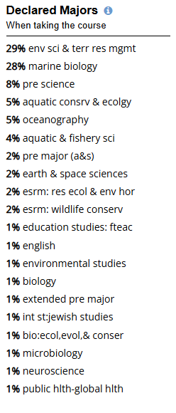
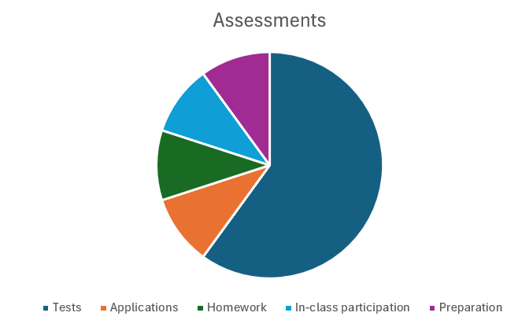

# (PART) Workbook Chapters {-}

# Intro Calculus Workbook
## Teaching Team Introductions
### Gaj Sivandran

**Teaching Interests**

- Design (freshman and senior)
- Fundamental engineering (statics, fluids)
- Environmental labs
- Water resources

**Research Interests**

- Climate change
- Active learning pedagogy
- Simulation modeling
- Decision support (socio-economic modelling) 

**Random Facts**

- I have an 11yr old daughter that helps me write exam questions
- Dogs >Cats, Cricket > Baseball,  AFL > NFL, Vegemite > Peanut butter 
- I like to run very very long distances, stilling working on why

## Classroom Etiquette

{fig.alt='Decorative' style="float:right; width:250px; margin:10px;"}

- Please feel free to bring your breakfast/lunch to class – just be sure to clean up before you leave
- Bring whatever tech you need to take notes and engage. We will be using Poll everywhere 
- Ask questions – but please be respectful of all voices and views - wrong answers have more value than right ones!

## Why are you here?

::: promptbox

**Discussion**
In small groups:

{fig.alt='Decorative' style="float:right; width:200px; margin:10px;"}

- Introduce yourselves
- Why are you all here?
- What do you think this class could be useful for?
- What do you notice about the declared majors in this class?

              
:::

## My Expectations of You

{fig.alt='Cover of the book Endure' style="float:right; width:100px; margin:10px;"}

**Objective 1** : The ability to apply calculus to the natural system

- Calculus is a language that allows us to tell complex environmental stories

**Objective 2**: Effort

- The best definition of I have come across *the struggle to continue against a mounting desire to stop - Alex Hutchinson, Endure*

## Your Expectations of Me

::: promptbox
**Discussion**

In a small group make 2 lists

- What can you come to see me about?

        

- What should you find someone else for?
        

:::

## Syllabus Highlights

### Assessments

{fig.alt='Pie chart of assessment breakdown - percentages in text' style="float:right; width:500px; margin:10px;"}

**Preparation** [10%]

- Before class readings/questions
- After-class self checks

**Participation** [10%]

- In-class activities
- Polleverywhere

**Homeworks** [10%]

- Roughly every week 
- Revise and resubmit
- Grade on accuracy and effort

**Tests** [60%]

- 4 Tests over the term 
- 2 can be re-taken during finals week
- 1 pg of notes (2sides)

**Applications** [10%]

- A couple of case studies that utilize the content we cover in class

::: promptbox
**Class discussion**

Why do you think there is so much weight on tests and participation?

    
:::

### Acedemic Integrity

This class has been designed to reward you for doing your **own** work
Tests will be relatively straightforward if you make the effort on the in-class and homework assessments

Using these resources will only make studying for tests harder. Many of these resources give you the *illusion* of understanding - but the reality is quite different.

{fig.alt='A picture of a person trying to climb a pyramid made up of milk crates' style="float:right; width:300px; margin:10px;"}

{fig.alt='Pie chart of assessment breakdown - percentages in text' style="width:300px; margin:10px;"}

### Late Assessment / Missed Assessment Policy

This is a firm policy to make sure I am being fair to all of you.

**Grace period:** Homeworks for this class are due Friday at 11:59pm. Homeworks will be accepted 72 hrs after their due date with no penalty (Monday 11:59pm). Graded work not turned in by this time will receive a grade of zero.

**Missed Tests**: If you miss a test, you will need to use one of your 're-takes' during finals weeks to do it. However, if you have a legitimate reason, I will work with you to reschedule the test earlier so you can save your re-take.

**Missed Class Preparation/Participation:** From time to time we miss class for several reasons (studying for another test that day, field work, illness, etc). There will be **no opportunity** to submit preparation and participation activities if they are missed. The purpose of these activities are to reinforce concepts in the moment – and have little value out the context of the material being covered that day.

To accommodate for this, 5% of the total preparation and participation assessments will be dropped. There will also be additional extra-credit opportunities throughout the term. 

**Exceptional Circumstances**: You must contact me 48 hours before the **actual** due date (not after the 48hr grace period) of a graded assignment to give me advanced notice, or within 12 hours after the work is due in the case of an emergency. If you fail to do this, you will receive zero credit for the missed assignment.

::: promptbox

**Class Discussion** 

What do we consider **exceptional circumstances**?

{fig.alt='Decorative cartoon of common excuses' style="left; width:300px; margin:10px;"}
:::

### Test Retakes Policy

There is no Final in this class – BUT – I will use the finals timeslot for the retakes. So don't plan an early break if you think you might be doing a retake.

If you miss a test during the term for a valid reason (health, emergency etc) and inform me in a timely manner, I’ll schedule a time during office hours for you to take the test. This flexibility is only good for a couple of days as I want to get the graded tests back to the rest of the class.

If you miss a test for another reason (slept in, went to a wedding etc) you can always use one of your retakes – that’s what they are for.

Reasons to retake
Missed a test
Want to try for a better grade
Love calc so much you want to do more problems

You can retake upto 2 tests. Your best score counts – so no risk

### Class notes

All notes that I take in class are available on the onenote notebook link on Canvas
All lectures will be recorded - these will also be made available on Canvas

From time to time the technology will fail us. Remember these are being provided as a *bonus*. There is no substitute for attending class and taking your own notes.

### Office Hours

Please select ALL times that **could** work.

I will always try to hang around for 30mins or so after class to answer any questions.

Office hours will be posted on Canvas as soon as they are set.

   

## Questions?
::: promptbox

**Class discussion**

Ask me anything - whats on your mind - need clarification on any of the things we've talked about?
         

:::

