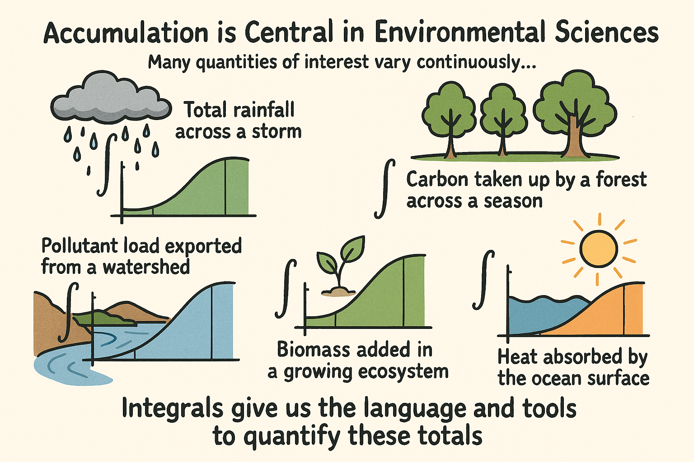
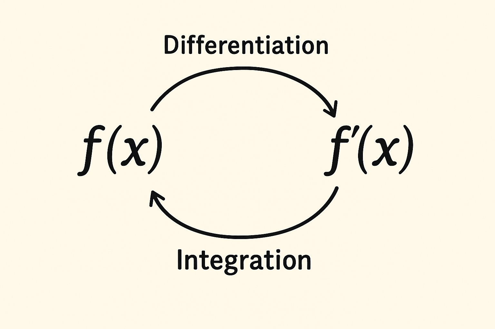

# Workbook — Introduction to Calculus II: Accumulation and Change

> **Goal of this workbook:**  
> To help you build intuition for accumulation, connect rates to totals, and begin thinking like a modeler of natural systems.

You are not expected to compute integrals yet. Instead, you will **reason**, **sketch**, **estimate**, and **explain**.

---

## Part 1 — From Instantaneous Change to Accumulated Change

### Warm-Up: Thinking Back to Calculus I

::: promptbox

**Individual reflection (2–3 minutes):**

1. In Calculus I, what did a **derivative** tell you about a system?
2. Give one environmental example where a *rate of change* is more meaningful than a total.
3. Give one example where a *total* is more meaningful than a rate.

<br><br><br><br><br>

:::

---

### Small-Group Discussion

::: promptbox

In groups of 2–3, discuss:

- Why might scientists care about **rates** in some situations and **totals** in others?
- Can you think of a case where knowing the rate alone would be misleading?

Be ready to share one example with the class.

<br><br><br><br><br><br><br><br><br><br>

:::

{fig.cap="" fig.alt="" style="float=center; width:450px; margin:10px;"}

---

## Part 2 — Accumulation as “Adding Small Pieces”

### Concept Check: Discrete Accumulation

::: promptbox

Consider the 3-hour storm example from the chapter.
- Hour 1: 4 mm/hour  
- Hour 2: 7 mm/hour  
- Hour 3: 5 mm/hour 

**Prompt:**

1. What assumptions are we making about rainfall intensity within each hour?
2. Why does adding the three hourly amounts give the correct total rainfall?
3. What are the *units* of:
   - rainfall rate?
   - total rainfall?
4. How much rainfall fell?

<br><br><br><br><br><br><br><br><br><br>

:::

---

### Visual Reasoning Prompt

::: promptbox

Without calculating anything:

- Sketch three rectangles representing the storm.
- Label the height and width of each rectangle.
- Explain (in words) how the **area** of each rectangle relates to rainfall.

🧠 *Key idea to articulate:*  
Why does “rate × time” produce a total?

<br><br><br><br><br>

:::

---


## Part 3 — When Rates Vary Continuously

::: promptbox

**Individual Prompt: Reading a Graph**


```{r, echo=FALSE, warning=FALSE, message=FALSE}
library(tidyverse)
library(lubridate)

txt <- "
5\t9:53\t0.05
5\t8:53\t0.15
5\t7:53\t0.58
5\t6:53\t0.18
5\t5:53\t
5\t4:53\t0.03
5\t3:53\t0.03
5\t2:53\t0.1
5\t1:53\t0.08
5\t0:53\t
4\t23:53\t0.23
4\t22:53\t
4\t21:53\t
4\t20:53\t
4\t19:53\t
4\t18:53\t
4\t17:53\t
4\t16:53\t
4\t15:53\t0.15
4\t14:53\t0.15
4\t13:53\t0.03
4\t12:53\t
4\t11:53\t
4\t10:53\t
4\t9:53\t
4\t8:53\t0.08
4\t7:53\t0.13
4\t6:53\t0.43
4\t5:53\t0.2
4\t4:53\t
4\t3:53\t
4\t2:53\t
4\t1:53\t
4\t0:53\t
3\t23:53\t0.03
3\t22:53\t0.08
3\t21:53\t
3\t20:53\t0.03
3\t19:53\t
3\t18:53\t0.05
3\t17:53\t
3\t16:53\t
3\t15:53\t
3\t14:53\t
3\t13:53\t
3\t12:53\t
3\t11:53\t
3\t10:53\t0.03
3\t9:53\t0.05
3\t8:53\t0.25
3\t7:53\t0.25
3\t6:53\t0.74
3\t5:53\t0.08
3\t4:53\t0.03
3\t3:53\t
3\t2:53\t0.03
3\t1:53\t
3\t0:53\t
2\t23:53\t
2\t22:53\t
2\t21:53\t
2\t20:53\t
2\t19:53\t
2\t18:53\t0.1
2\t17:53\t0.05
2\t16:53\t
2\t15:53\t
2\t14:53\t
2\t13:53\t0.03
2\t12:53\t
2\t11:53\t
"

df <- readr::read_tsv(
  base::I(txt),
  col_names = c("day", "time", "rain_cm"),
  col_types = cols(
    day = col_integer(),
    time = col_character(),
    rain_cm = col_double()
  )
) %>%
  mutate(
    rain_cm = tidyr::replace_na(rain_cm, 0),
    hour = readr::parse_number(time)
  )

df <- df %>%
  mutate(order_key = day * 24 + hour) %>%
  arrange(order_key)

full <- tibble(order_key = seq(min(df$order_key), max(df$order_key), by = 1)) %>%
  left_join(df %>% select(order_key, rain_cm), by = "order_key") %>%
  mutate(rain_cm = tidyr::replace_na(rain_cm, 0),
         hours_since_start = order_key - min(order_key))

ggplot(full, aes(x = hours_since_start, y = rain_cm)) +
  geom_col() +
  labs(x = "Hours since start", y = "Hourly rainfall (cm)",
       title = "Hourly Rainfall (zeros included)") +
  theme_minimal()

ggplot(full, aes(x = hours_since_start, y = rain_cm)) +
  geom_line(linewidth = 1) +
  geom_point(size = 2) +
  labs(x = "Hours since start", y = "Hourly rainfall (cm)",
       title = "Hourly Rainfall Time Series (Zeros Included)") +
  theme_minimal()

```

Look at the graphs of rainfall intensity that varies continuously over time.

Answer the following without doing any calculations:

1. During which parts of the storm is rainfall accumulating fastest?
2. During which parts is it accumulating slowest?
3. Does the rainfall ever stop accumulating entirely? Why or why not?
4. Which representation is more accurate?

<br><br><br><br><br><br><br><br><br><br>

:::

---

### Think–Pair–Share

::: promptbox

Discuss with a partner:

- Why is it harder to compute total rainfall from this graph?
- What would happen if we tried to approximate the total using rectangles?
- What trade-off would we face between **accuracy** and **effort**?

<br><br><br><br><br>

:::

---

## Part 4 — Riemann Sums as an Idea (Not a Formula)

::: promptbox

Imagine breaking the storm into:

- 3 rectangles  
- 10 rectangles  
- 100 rectangles  

For each case:

1. Would your estimate of total rainfall improve?
2. What would become harder or more time-consuming?
3. At what point does this process start to feel impractical?

<br><br><br><br><br><br><br><br><br><br>

:::

---

## Part 5 — Reversing Derivatives

### Conceptual Prompt

::: promptbox

{fig.cap="" fig.alt="A simple conceptual diagram showing the relationship between differentiation and integration. On the left is a function f(x) a differentiation arrow points to f'(x). Another arrow goes from right to left, from f'(x) to f(x) with the word integration" style="float=center; width:450px; margin:10px;"}

A derivative answers:  
> *“How fast is this changing right now?”*

An integral answers:  
> *“How much has changed overall?”*

**Answer in your own words:**

1. What does it mean to “reverse” a derivative?
2. Why might it be easier to measure or model a rate than a total?
3. Give an environmental example where you would:
   - measure a rate,
   - but care about a total.
   
<br><br><br><br><br><br><br><br><br><br>

:::

---

