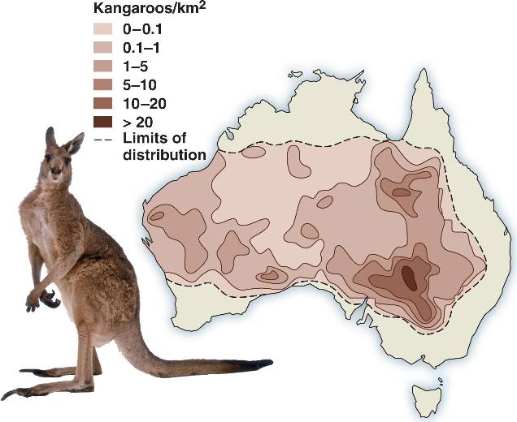

# Student Discussion + Activity Template: Applications of Integration

**Goal for this section**  
Build the habit of asking: *What is accumulating? Over what variable? What do the units imply?*  
Then practice translating that story into an integral, and interpreting the result.

---

## Discussion Prompts (use as think–pair–share)

**Prompt Set A: What is an integral doing? (meaning first)**

1. In your own words, what does “accumulation” mean? Give one real-world example that is *not* about area.
2. What’s the difference between a **rate** and a **total**? Give an example of each.
3. Why does “small pieces add up” naturally lead to an integral?
4. What does the \(dx\) or \(dt\) tell you about what you are adding up?
5. What would it mean if an integral gave a negative answer in a real system?

**Prompt Set B: Units as a reality check**

6. Suppose \(r(t)\) has units of mm/hr and you integrate \(r(t)\,dt\). What are the units of the result? Does that match what you want to measure?
7. Suppose \(\rho(x,y)\) has units of kg/m\(^2\). What does \(\iint_R \rho(x,y)\,dA\) represent?
8. If your units don’t cancel cleanly into something meaningful, what are two possible reasons?

**Prompt Set C: Total vs net vs “area between curves”**

9. Compare these three questions. Which one matches each integral, and why?
   - (i) “How much was produced?”
   - (ii) “What was the net change?”
   - (iii) “How different are these two curves overall?”
   \[
   \int_0^T P(t)\,dt,\qquad \int_0^T (P(t)-L(t))\,dt,\qquad \int_0^T |P(t)-L(t)|\,dt
   \]
10. If two curves cross, what changes about the setup for **geometric area**? What doesn’t change for **net accumulation**?

**Prompt Set D: When data are messy (numerical integration)**

11. When you measure something daily, why isn’t the “true integral” immediately available?
12. What do you gain by fitting a smooth function to data? What might you lose?
13. In your streamflow example, why were the “fit” total and the “rectangles” total close but not identical?
14. If you were writing a report, when would you trust the fitted model more than the data rectangles? When would you do the opposite?

---

## In-Class Mini-Workflow 

**Step 1: Story**
- What is changing?  
- What is being added up?  
- Over what variable?

**Step 2: Units**
- Write the units of the integrand.
- Write the units of the differential (\(dx\), \(dt\), \(dA\), \(dV\)).
- Multiply them to predict the units of the result.

**Step 3: Setup**
- Total? Net? Area between curves? Average?
- Write the correct integral.

**Step 4: Compute or approximate**
- If there’s a clean function, integrate.
- If data are discrete or messy, approximate numerically.

**Step 5: Interpret**
- What does the number mean in context?
- Sense check: Is the sign reasonable? Is the magnitude plausible?

---

## Worked Example 1: Average Value

**Task**  
Compute the average value of
\[
f(x)=x^2
\]
on \([2,4]\), and interpret it as an “equal-area rectangle.”

**Prompts during the solution**

- What does “average value” mean for a function?
- Why are we dividing by \(b-a\)?
- What does the rectangle represent geometrically?

**Solution skeleton**
General form of the average equation

\[
f_{\text{avg}}=\frac{1}{b-a}\int_a^b f(x)\,dx
\]

So in this example:

\[
f_{\text{avg}}=\frac{1}{4-2}\int_2^4 x^2\,dx
\]
\[
\int_2^4 x^2\,dx = \left.\frac{x^3}{3}\right|_2^4
\]
\[
f_{\text{avg}}=\frac{1}{2}\cdot \frac{56}{3}=\frac{28}{3}
\]

**Follow-up prompt**

- If \(f(x)\) were sometimes negative, how would that affect the “average”?

---

## Worked Example 2: Area Between Curves with a Crossing

**Task**  
Find the geometric area between
\[
f(x)=x,\qquad g(x)=x^3
\]
on \([-1,1]\).

```{r, echo=FALSE, message=FALSE, error=FALSE}
# Plot the geometric area between f(x) = x and g(x) = x^3 on [-1, 1]

# Define the functions
f <- function(x) x
g <- function(x) x^3

# Create x values
x <- seq(-1, 1, length.out = 500)

# Evaluate functions
f_vals <- f(x)
g_vals <- g(x)

# Set up the plot
plot(
  x, f_vals,
  type = "l",
  lwd = 2,
  ylim = range(c(f_vals, g_vals)),
  xlab = "x",
  ylab = "y",
  main = expression("Geometric Area Between " ~ f(x) == x ~ " and " ~ g(x) == x^3)
)

# Add the second curve
lines(x, g_vals, lwd = 2, lty = 2)

# Shade area on [-1, 0]: g(x) is above f(x)
x_left <- seq(-1, 0, length.out = 250)
polygon(
  c(x_left, rev(x_left)),
  c(g(x_left), rev(f(x_left))),
  col = rgb(0.2, 0.6, 0.8, 0.3),
  border = NA
)

# Shade area on [0, 1]: f(x) is above g(x)
x_right <- seq(0, 1, length.out = 250)
polygon(
  c(x_right, rev(x_right)),
  c(f(x_right), rev(g(x_right))),
  col = rgb(0.2, 0.6, 0.8, 0.3),
  border = NA
)

# Add reference lines
abline(h = 0, lty = 3)
abline(v = 0, lty = 3)

# Add legend
legend(
  "topleft",
  legend = c("f(x) = x", "g(x) = x^3", "Geometric area"),
  lwd = c(2, 2, NA),
  lty = c(1, 2, NA),
  pch = c(NA, NA, 15),
  pt.cex = 2,
  col = c("black", "black", rgb(0.2, 0.6, 0.8, 0.3)),
  bty = "n"
)


```

**Student prompts**

1. Where do the curves intersect?
2. On \([-1,0]\), which is on top?
3. On \([0,1]\), which is on top?
4. Why can’t we just do \(\int_{-1}^{1} (f-g)\,dx\) and call that “area”?

**Solution skeleton**

- Intersections: \(x=-1,0,1\)
- Set up:
\[
\text{Area}=\int_{-1}^{0} (g-f)\,dx + \int_{0}^{1} (f-g)\,dx
\]
- Compute and add.

**Extension**

- Replace “area” with “net difference.” What changes in the setup?

---

## Worked Example 3: Numerical Integration from Data (no curve fitting)

**Task**  
You measured daily streamflow \(Q_i\) (m\(^3\)/s) for 7 days. Estimate the total volume of water that passed the gauge in that week.

**Give students a small dataset**

Day: 1  2  3  4  5  6  7  
\(Q\): 42  55  61  58  49  45  40  (m\(^3\)/s)

```{r, echo=FALSE, message=FALSE, error=FALSE}
# Small dataset: Daily streamflow over one week
# Points only, days labeled 1 through 7, x-axis starting at 0

# Data
day <- 1:7
Q <- c(42, 55, 61, 58, 49, 45, 40)  # m^3/s

streamflow_week <- data.frame(day = day, Q = Q)

# ---- Plot the data (points only) ----
plot(
  streamflow_week$day,
  streamflow_week$Q,
  type = "p",          # points only
  pch = 16,
  cex = 1.2,
  xlim = c(0, 7.5),    # start x-axis at 0
  xlab = "Time (days)",
  ylab = expression(Streamflow~(m^3/s)),
  main = "Daily Streamflow Measurements (One Week)"
)

# Add a light grid for readability
grid()

# Reference line at zero
abline(h = 0, lty = 3)


```

**Prompts**

1. If each value is “m\(^3\)/s,” what does multiplying by one day do to the units?
2. Why do we need to convert days to seconds?
3. Use rectangles to estimate weekly volume:
\[
V \approx \sum_{i=1}^{7} Q_i \,\Delta t
\]
4. If you used trapezoids instead, would the estimate increase or decrease? Why?

**Solution skeleton**

- \(\Delta t = 86400\) s per day
- Rectangles:
\[
V \approx 86400\sum_{i=1}^{7} Q_i
\]
- (Optional) trapezoids for comparison:
\[
V \approx \frac{86400}{2}\left(Q_1+2Q_2+\cdots+2Q_6+Q_7\right)
\]

**Reflection prompt**

- Which method (rectangles or trapezoids) seems more defensible here, and why?

---

## Counting Species

How would you work out how many trees there are in a forest?
Or how many whales in the ocean?

Come up with a method for working out how many trees there are on this campus?

<br><br><br><br><br><br><br><br><br><br>


How would I work out how many Kangaroos there are in Australia?

{fig.cap="" fig.alt="" style="float=center; width:450px; margin:10px;"}

<br><br><br><br><br><br><br><br><br><br>


\newpage

## Thinking with Double Integrals

**Purpose of this activity**  
Practice translating *spatial accumulation stories* into double integrals, before worrying about heavy computation. The focus is on:

- identifying what is accumulating,
- understanding the region of integration,
- interpreting the result using units.

---

## Part A: Conceptual Warm-Up (Think → Pair → Share)

**Prompt 1: What is being accumulated?**  
For each statement below, decide whether a **double integral** is appropriate and explain why.

1. Total rainfall over a rectangular field during a storm.  
2. Average air temperature along a hiking trail.  
3. Total mass of algae in a shallow lake, where concentration varies by location.  
4. Total distance traveled by a migrating animal.


---

**Prompt 2: Units check**

Suppose \(f(x,y)\) has units of **kg/m²**.

1. What are the units of \(f(x,y)\,dA\)?  
2. What are the units of \(\iint_R f(x,y)\,dA\)?  
3. What real-world quantity might this integral represent?

---

## Part B: From Single to Double Integrals

**Prompt 3: Extending what you know**

Recall:
\[
\int_a^b f(x)\,dx
\]

1. What does this accumulate?
2. What does the “small piece” look like?

Now compare with:
\[
\iint_R f(x,y)\,dA
\]

3. What is the small piece now?
4. How is the logic the same? How is it different?

---

## Part C: Setting Up (Not Solving) Double Integrals

### Example 1: Constant Density Over a Region

Suppose pollution is distributed uniformly over a rectangular area.

- Density: \( \rho(x,y) = 5 \) kg/m²  
- Region:  
  \[
  R = \{(x,y)\mid 0 \le x \le 4,\; 0 \le y \le 3\}
  \]

**Student tasks**

1. Write a double integral that represents the **total pollutant mass**.
2. Before computing anything, predict whether the answer should be:
   - small or large?
   - positive or zero?

**Setup**
\[
\iint_R 5\,dA
=
\int_0^4 \int_0^3 5\,dy\,dx
\]

**Discussion prompt**  
Why does this integral reduce to “density × area”?

---

### Example 2: Variable Density Over a Rectangle

Now suppose density varies with position:
\[
\rho(x,y) = x + y
\]

on the same region
\[
R = \{(x,y)\mid 0 \le x \le 4,\; 0 \le y \le 3\}.
\]

**Student tasks**

1. Write the double integral for total mass.
2. Decide whether it makes more sense to integrate with respect to \(x\) or \(y\) first.
3. What does “holding one variable constant” mean physically?

**Setup**
\[
\iint_R (x+y)\,dA
=
\int_0^4 \int_0^3 (x+y)\,dy\,dx
\]

*(Do not compute yet — focus on interpretation.)*

---

## Part D: Interpreting Inner Integrals

**Prompt 4: What does the inner integral represent?**

Given:
\[
\int_0^4 \left[\int_0^3 (x+y)\,dy\right] dx
\]

1. What does the inner integral compute when \(x\) is fixed?
2. What does the outer integral add up?
3. How is this like “stacking” single integrals?

```{r, echo=FALSE, message=FALSE, error=FALSE}
# Plot for the iterated integral
# ∫_0^4 [ ∫_0^3 (x + y) dy ] dx
# Visualizing f(x, y) = x + y over the rectangular region

# Define the region
x <- seq(-1, 5, length.out = 200)
y <- seq(-1, 4, length.out = 200)

grid <- expand.grid(x = x, y = y)

# Define the function
f <- function(x, y) {
  x + y
}

# Evaluate on the grid
z <- matrix(f(grid$x, grid$y), nrow = length(x), ncol = length(y))

# Filled contour plot
filled.contour(
  x, y, z,
  color.palette = colorRampPalette(c("blue", "white", "red")),
  xlab = "x",
  ylab = "y",
  main = expression(f(x, y) == x + y),
  plot.axes = {
    axis(1)
    axis(2)
    
    # Draw the integration region: 0 ≤ x ≤ 4, 0 ≤ y ≤ 3
    rect(
      xleft = 0, ybottom = 0,
      xright = 4, ytop = 3,
      lwd = 2,
      lty = 2,
      border = "black"
    )
  }
)

```


---

## Part E: Symmetry and Cancellation

### Example 3: When Things Cancel

Let
\[
f(x,y) = y
\]
over the symmetric region
\[
R = \{(x,y)\mid -2 \le x \le 2,\; -3 \le y \le 3\}.
\]

```{r, echo=FALSE, message=FALSE, error=FALSE}
# Plot for f(x, y) = y over the symmetric region
# R = { (x, y) | -2 <= x <= 2, -3 <= y <= 3 }

# Create grid
x <- seq(-2, 2, length.out = 200)
y <- seq(-3, 3, length.out = 200)

grid <- expand.grid(x = x, y = y)

# Define the function
f <- function(x, y) {
  y
}

# Evaluate the function on the grid
z <- matrix(f(grid$x, grid$y), nrow = length(x), ncol = length(y))

# Filled contour plot
filled.contour(
  x, y, z,
  color.palette = colorRampPalette(c("blue", "white", "red")),
  xlab = "x",
  ylab = "y",
  main = expression(f(x, y) == y),
  plot.axes = {
    axis(1)
    axis(2)
    
    # Draw the boundary of the region R
    rect(
      xleft = -2, ybottom = -3,
      xright =  2, ytop =  3,
      lwd = 2,
      lty = 2,
      border = "black"
    )
    
    # Reference lines for symmetry
    abline(h = 0, v = 0, lty = 3)
  }
)

```


**Student tasks**

1. Sketch the region.
2. Predict the value of
   \[
   \iint_R y\,dA
   \]
   before computing.
3. Explain your reasoning using symmetry.

**Key idea prompt**  
What does it mean for a function to be “odd” in one variable over symmetric bounds?

---

## Part F: Average Value Over a Region

**Prompt 5: Average vs total**

For a function \(f(x,y)\) over a region \(R\):

1. What does \(\iint_R f(x,y)\,dA\) represent?
2. How would you turn that into an **average value** over the region?

**Definition**
\[
f_{\text{avg}} = \frac{1}{\text{Area}(R)} \iint_R f(x,y)\,dA
\]

**Think-pair-share**

- What would the units of \(f_{\text{avg}}\) be?
- How does this mirror the 1D average value formula?

---


\newpage

## Area Between Two Curves — Conceptual and Computational Practice

These problems are designed to help you practice:

- Setting up **top minus bottom**
- Understanding what happens when curves **cross**
- Distinguishing **net accumulation** from **geometric area**
- Handling situations where functions are **negative**
- Interpreting integrals of **rates**

---

### Problem 1 — Basic Geometric Area (No Crossing) {-}

Consider  
\[
f(x) = 6 - x^2
\]  
\[
g(x) = 2
\]
```{r, echo=FALSE, message=FALSE, error=FALSE}
# Define functions
f <- function(x) 6 - x^2
g <- function(x) rep(2, length(x))

# x-grid
x_vals <- seq(-3, 3, length.out = 500)

# Plot f(x)
plot(x_vals, f(x_vals), type = "l",
     ylim = c(-1, 7),
     lwd = 3,
     col = "#1f78b4",          # blue
     xlab = "x", ylab = "y",
     main = "Area Between f(x)=6-x^2 and g(x)=2")

# Add g(x)
lines(x_vals, g(x_vals), lwd = 3, col = "#e31a1c")  # red

# Shade area between -2 and 2
x_fill <- seq(-2, 2, length.out = 500)
polygon(c(x_fill, rev(x_fill)),
        c(f(x_fill), rev(g(x_fill))),
        col = adjustcolor("#6a3d9a", alpha.f = 0.3),  # purple shading
        border = NA)

# Redraw curves on top so they stay crisp
lines(x_vals, f(x_vals), lwd = 3, col = "#1f78b4")
lines(x_vals, g(x_vals), lwd = 3, col = "#e31a1c")

# Mark intersection points
points(c(-2, 2), c(2, 2), pch = 19, col = "black", cex = 1.2)

# Light grid for readability
grid(col = "grey85")

legend("topright",
       legend = c("f(x) = 6 - x^2", "g(x) = 2"),
       col = c("#1f78b4", "#e31a1c"),
       lwd = 3,
       bty = "n")

```


::: promptbox

1. Find the points where the curves intersect.
2. Determine which function is on top between those points.
3. Set up the integral for the **geometric area** between the curves.
4. Evaluate the area.

:::

---

### Problem 2 — When Curves Cross {-}

Consider  
\[
f(x) = x
\]  
\[
g(x) = x^3
\]

on the interval \([-1,1]\).

```{r, echo=FALSE, message=FALSE, error=FALSE}
# Define functions
f <- function(x) x
g <- function(x) x^3

# x-grid
x_vals <- seq(-1.5, 1.5, length.out = 500)

# Plot f(x)
plot(x_vals, f(x_vals), type = "l",
     lwd = 3,
     col = "#1f78b4",  # blue
     xlab = "x", ylab = "y",
     ylim = c(-1.5, 1.5),
     main = "Area Between f(x)=x and g(x)=x^3 on [-1,1]")

# Add g(x)
lines(x_vals, g(x_vals), lwd = 3, col = "#e31a1c")  # red

# Shade geometric area (split at 0)

# Left half: g(x) is on top
x_left <- seq(-1, 0, length.out = 300)
polygon(c(x_left, rev(x_left)),
        c(g(x_left), rev(f(x_left))),
        col = adjustcolor("#6a3d9a", alpha.f = 0.3),
        border = NA)

# Right half: f(x) is on top
x_right <- seq(0, 1, length.out = 300)
polygon(c(x_right, rev(x_right)),
        c(f(x_right), rev(g(x_right))),
        col = adjustcolor("#6a3d9a", alpha.f = 0.3),
        border = NA)

# Redraw curves for clarity
lines(x_vals, f(x_vals), lwd = 3, col = "#1f78b4")
lines(x_vals, g(x_vals), lwd = 3, col = "#e31a1c")

# Mark intersection points
points(c(-1, 0, 1), c(-1, 0, 1), pch = 19, cex = 1.2)

# Add light grid
grid(col = "grey85")

legend("topleft",
       legend = c("f(x) = x", "g(x) = x^3"),
       col = c("#1f78b4", "#e31a1c"),
       lwd = 3,
       bty = "n")

```

::: promptbox
**Part A — Intersection Points**

1. Find all values of \(x\) where the functions are equal.
2. Determine which function is on top on each part of the interval.

:::

::: promptbox
**Part B — Do NOT Split the Integral**

Without breaking the interval apart, compute:

\[
\int_{-1}^{1} \big(f(x) - g(x)\big)\,dx
\]

1. Evaluate the integral.
2. What does this value represent?
3. Why does cancellation occur?

:::

::: promptbox
**Part C — Now Compute the Geometric Area**

1. Identify where the functions switch which one is on top.
2. Split the integral at the intersection point(s).
3. Set up integrals that always compute **top minus bottom**.
4. Evaluate the total geometric area between the curves.

:::

::: promptbox

**Part D — Reflection**

1. Compare the answers from Parts B and C.
2. Why are they different?
3. When must an integral be split?
4. What does the unsplit integral actually measure?

:::

---

### Problem 3 — Net Change Between Two Rates {-}

A lake has:

- Inflow rate:
\[
I(t) = 5 + 2t
\]

- Outflow rate:
\[
O(t) = 3 + t
\]

where \(t\) is in days and rates are in millions of gallons per day.


```{r, echo=FALSE, message=FALSE, error=FALSE}
# Rates
I <- function(t) 5 + 2*t
O <- function(t) 3 + t
N <- function(t) I(t) - O(t)   # net rate

# Time grid
t_vals <- seq(0, 4, length.out = 400)

# Plot inflow and outflow
plot(t_vals, I(t_vals), type = "l",
     lwd = 3,
     col = "#1f78b4",  # blue
     ylim = c(0, 14),
     xlab = "t (days)",
     ylab = "rate (million gallons/day)",
     main = "Net Change in Lake Volume: Area Between Inflow and Outflow")

lines(t_vals, O(t_vals), lwd = 3, col = "#e31a1c")  # red

# Shade area between curves on [0,4]
t_fill <- seq(0, 4, length.out = 400)
polygon(c(t_fill, rev(t_fill)),
        c(I(t_fill), rev(O(t_fill))),
        col = adjustcolor("#33a02c", alpha.f = 0.25),  # green shading
        border = NA)

# Re-draw curves on top
lines(t_vals, I(t_vals), lwd = 3, col = "#1f78b4")
lines(t_vals, O(t_vals), lwd = 3, col = "#e31a1c")

# Add net rate as dashed line (secondary visual cue)
lines(t_vals, N(t_vals), lwd = 2, lty = 2, col = "#6a3d9a")  # purple dashed

# Add light grid
grid(col = "grey85")

legend("topleft",
       legend = c("Inflow I(t) = 5 + 2t",
                  "Outflow O(t) = 3 + t",
                  "Net rate N(t) = I(t) - O(t)"),
       col = c("#1f78b4", "#e31a1c", "#6a3d9a"),
       lwd = c(3, 3, 2),
       lty = c(1, 1, 2),
       bty = "n")

```

::: promptbox

1. Write an expression for the **net rate of change** of the lake volume.
2. Over \(0 \le t \le 4\), compute the **net change in water volume**.
3. Does the lake gain or lose water overall?
4. Explain how this problem is structurally similar to area between curves.

:::

---

### Problem 4 — Crossing Rates (Net vs Geometric Difference)  {-}
Before working this problem, it is important to clarify what we mean by **advantage**.

At any single moment in time, each species has a *growth rate*. A growth rate tells us how fast the population is increasing at that instant. If one species has a larger growth rate than the other at time \(t\), then it is growing faster at that moment.

So we define the **instantaneous advantage** of Species 1 over Species 2 as

\[
R_1(t) - R_2(t).
\]

- If this quantity is positive, Species 1 is growing faster.
- If it is negative, Species 2 is growing faster.
- If it is zero, neither species has an advantage at that moment.

But we are often interested in more than a snapshot. We may want to know:

- Which species gained more total growth over a time period?
- Did one species’ early advantage outweigh the other’s later advantage?

To answer that, we integrate.

\[
\int_a^b \big(R_1(t) - R_2(t)\big)\,dt
\]

This integral represents the **net advantage** over the interval \([a,b]\).  
Geometrically, it is the signed area between the two rate curves.

If positive and negative regions cancel, the net advantage may be zero — even though one species led for part of the time. If we instead integrate the absolute value,

\[
\int_a^b \left|R_1(t) - R_2(t)\right| dt,
\]

we measure the **total geometric difference**, which captures how much the species differed overall, regardless of who was ahead.

Keep this distinction in mind as you work the problem below.


Two species have population growth rates:

\[
R_1(t) = 8 - t
\]  
\[
R_2(t) = t
\]

for \(0 \le t \le 8\).

```{r, echo=FALSE, message=FALSE, error=FALSE}
# Growth rates
R1 <- function(t) 8 - t
R2 <- function(t) t

# Time grid
t_vals <- seq(0, 8, length.out = 500)

# Plot curves
plot(t_vals, R1(t_vals), type = "l",
     lwd = 3,
     col = "#1f78b4",  # blue
     ylim = c(0, 8),
     xlab = "t",
     ylab = "Growth rate",
     main = "Crossing Rates: Net vs Geometric Difference")

lines(t_vals, R2(t_vals), lwd = 3, col = "#e31a1c")  # red

# Crossing point at t = 4
points(4, 4, pch = 19, cex = 1.3)

# Shade region where R1 > R2 (0 to 4)
t_left <- seq(0, 4, length.out = 300)
polygon(c(t_left, rev(t_left)),
        c(R1(t_left), rev(R2(t_left))),
        col = adjustcolor("#33a02c", alpha.f = 0.3),
        border = NA)

# Shade region where R2 > R1 (4 to 8)
t_right <- seq(4, 8, length.out = 300)
polygon(c(t_right, rev(t_right)),
        c(R2(t_right), rev(R1(t_right))),
        col = adjustcolor("#ff7f00", alpha.f = 0.3),
        border = NA)

# Redraw curves on top
lines(t_vals, R1(t_vals), lwd = 3, col = "#1f78b4")
lines(t_vals, R2(t_vals), lwd = 3, col = "#e31a1c")

# Light grid
grid(col = "grey85")

# Legend (curves only)
legend("topright",
       legend = c("R1(t) = 8 - t",
                  "R2(t) = t"),
       col = c("#1f78b4", "#e31a1c"),
       lwd = 3,
       bty = "n")

```

::: promptbox

1. Find when the two rates are equal.
2. Compute the **net advantage** of Species 1 over Species 2 on \([0,8]\) using a single integral.
3. Interpret your result.
4. Now compute the **total geometric difference** between the rates on the interval.
5. Why are the two answers different?
:::

---

### Problem 5 — Both Functions Negative {-}

Consider  
\[
f(x) = -x^2 - 1
\]  
\[
g(x) = -3
\]

```{r, echo=FALSE, message=FALSE, error=FALSE}
# Define functions
f <- function(x) -x^2 - 1
g <- function(x) rep(-3, length(x))

# Intersection points: -x^2 - 1 = -3  →  x^2 = 2 → x = ±sqrt(2)
a <- sqrt(2)

# x-grid
x_vals <- seq(-2, 2, length.out = 500)

# Plot f(x)
plot(x_vals, f(x_vals), type = "l",
     lwd = 3,
     col = "#1f78b4",   # blue
     ylim = c(-4, 1),
     xlab = "x",
     ylab = "y",
     main = "Geometric Area Between Two Negative Functions")

# Add g(x)
lines(x_vals, g(x_vals), lwd = 3, col = "#e31a1c")  # red

# Shade area between curves from -sqrt(2) to sqrt(2)
x_fill <- seq(-a, a, length.out = 400)
polygon(c(x_fill, rev(x_fill)),
        c(f(x_fill), rev(g(x_fill))),
        col = adjustcolor("#33a02c", alpha.f = 0.3),  # green shading
        border = NA)

# Redraw curves for clarity
lines(x_vals, f(x_vals), lwd = 3, col = "#1f78b4")
lines(x_vals, g(x_vals), lwd = 3, col = "#e31a1c")

# Mark intersection points
points(c(-a, a), c(-3, -3), pch = 19, cex = 1.3)

# Add light grid
grid(col = "grey85")

# Legend (curves only)
legend("topright",
       legend = c("f(x) = -x^2 - 1",
                  "g(x) = -3"),
       col = c("#1f78b4", "#e31a1c"),
       lwd = 3,
       bty = "n")

```

::: promptbox

1. Find the intersection points.
2. Determine which function is on top between those points.
3. Set up the integral for the **geometric area** between the curves.
4. Evaluate the area.
5. Explain why the result is positive even though both functions are negative.
6. What would happen if you accidentally reversed top and bottom?

:::

---

### Core Ideas to Understand  {-}

- Area between curves is always **top minus bottom**.
- When curves cross, you must consider **where the sign changes**.
- A single integral measures **net accumulation**, not always geometric area.
- Cancellation reflects signed area.
- Negative functions do not break the method — subtraction handles the sign.

<details open>
<summary><strong>Click to Unlock Solutions</strong></summary>

<div id="sol_set2" hidden markdown="1" style="margin-top:0.75rem;">


**Answer Key — Area Between Two Curves (Detailed)**

This key emphasizes two core ideas:

1. **Geometric area** between curves is computed using **top − bottom**, and if the curves cross you must split the integral so the integrand stays nonnegative.
2. A single integral of \((\text{one} - \text{other})\) over an interval gives **net (signed) accumulation**, not necessarily geometric area.

---

**Problem 1 — Basic Geometric Area (No Crossing)**

Given
\[
f(x)=6-x^2,\qquad g(x)=2.
\]

**1) Intersection points**

Solve \(f(x)=g(x)\):
\[
6-x^2=2 \;\Rightarrow\; x^2=4 \;\Rightarrow\; x=\pm 2.
\]

**2) Which is on top?**

Pick \(x=0\):
\[
f(0)=6,\quad g(0)=2 \;\Rightarrow\; f(x)\ge g(x)\text{ on }[-2,2].
\]

**3) Set up area integral (top − bottom)**

\[
A=\int_{-2}^{2}\big(f(x)-g(x)\big)\,dx
=\int_{-2}^{2}\big((6-x^2)-2\big)\,dx
=\int_{-2}^{2}(4-x^2)\,dx.
\]

**4) Evaluate**

Antiderivative:
\[
\int (4-x^2)\,dx = 4x-\frac{x^3}{3}.
\]

\[
A=\left[4x-\frac{x^3}{3}\right]_{-2}^{2}
=\left(8-\frac{8}{3}\right)-\left(-8+\frac{8}{3}\right)
=\frac{16}{3}-\left(-\frac{16}{3}\right)
=\frac{32}{3}.
\]

**Answer:** \(\displaystyle A=\frac{32}{3}\).

---

**Problem 2 — When Curves Cross**

Given
\[
f(x)=x,\qquad g(x)=x^3,\qquad x\in[-1,1].
\]

**Part A — Intersection points and who’s on top**

Solve \(x=x^3\):
\[
x^3-x=0 \;\Rightarrow\; x(x^2-1)=0 \;\Rightarrow\; x=-1,0,1.
\]

Compare \(f-g = x-x^3 = x(1-x^2)\).

- On \((-1,0)\): \(f-g<0\Rightarrow f<g\) (so \(g\) is on top).
- On \((0,1)\): \(f-g>0\Rightarrow f>g\) (so \(f\) is on top).

So:

- On \([-1,0]\), top \(=g(x)=x^3\).
- On \([0,1]\), top \(=f(x)=x\).

---

**Part B — Do NOT Split the Integral (net/signed area)**

\[
\int_{-1}^{1}(f-g)\,dx=\int_{-1}^{1}(x-x^3)\,dx.
\]

Antiderivative:
\[
\int (x-x^3)\,dx=\frac{x^2}{2}-\frac{x^4}{4}.
\]

\[
\left[\frac{x^2}{2}-\frac{x^4}{4}\right]_{-1}^{1}
=\left(\frac12-\frac14\right)-\left(\frac12-\frac14\right)=0.
\]

**Answer (Part B):** \(0\).

This represents the **net (signed) area**. Cancellation occurs because positive and negative regions are equal in magnitude.

---

**Part C — Geometric area (split so integrand is nonnegative)**

\[
A=\int_{-1}^{0}(x^3-x)\,dx+\int_{0}^{1}(x-x^3)\,dx.
\]

First integral:
\[
\int_{-1}^{0}(x^3-x)\,dx
=\left[\frac{x^4}{4}-\frac{x^2}{2}\right]_{-1}^{0}
=\frac14.
\]

Second integral:
\[
\int_{0}^{1}(x-x^3)\,dx
=\left[\frac{x^2}{2}-\frac{x^4}{4}\right]_{0}^{1}
=\frac14.
\]

Total:
\[
A=\frac14+\frac14=\frac12.
\]

**Answer (Part C):** \(\displaystyle A=\frac12.\)

Net area \(=0\), geometric area \(=\frac12\).

---

**Problem 3 — Net Change Between Two Rates**

\[
I(t)=5+2t,\qquad O(t)=3+t,\qquad 0\le t\le 4.
\]

**1) Net rate**

\[
\text{Net}(t)=I(t)-O(t)=2+t.
\]

**2) Net change**

\[
\Delta V=\int_{0}^{4}(2+t)\,dt.
\]

Antiderivative:
\[
2t+\frac{t^2}{2}.
\]

\[
\Delta V=\left[2t+\frac{t^2}{2}\right]_{0}^{4}
=8+8=16.
\]

**Answer:** \(16\) million gallons gained.

This is structurally identical to area between curves: inflow minus outflow.

---

**Problem 4 — Crossing Rates (Net vs Geometric Difference)**

\[
R_1(t)=8-t,\qquad R_2(t)=t,\qquad 0\le t\le 8.
\]

**1) Equal when**

\[
8-t=t \Rightarrow t=4.
\]

**2) Net advantage**

\[
\int_{0}^{8}(8-2t)\,dt
=\left[8t-t^2\right]_{0}^{8}
=0.
\]

Net advantage: \(0\).

**3) Geometric difference**

\[
A=\int_{0}^{4}(8-2t)\,dt+\int_{4}^{8}(2t-8)\,dt.
\]

First:
\[
\left[8t-t^2\right]_{0}^{4}=16.
\]

Second:
\[
\left[t^2-8t\right]_{4}^{8}=16.
\]

Total:
\[
A=32.
\]

Net \(=0\), geometric difference \(=32\).

---

**Problem 5 — Both Functions Negative**

\[
f(x)=-x^2-1,\qquad g(x)=-3.
\]

**1) Intersection points**

\[
-x^2-1=-3 \Rightarrow x^2=2 \Rightarrow x=\pm\sqrt{2}.
\]

**2) Which is on top?**

At \(x=0\): \(-1>-3\), so \(f\) is on top.

**3) Area setup**

\[
A=\int_{-\sqrt{2}}^{\sqrt{2}}(2-x^2)\,dx.
\]

**4) Evaluate**

\[
\int(2-x^2)\,dx=2x-\frac{x^3}{3}.
\]

Let \(a=\sqrt{2}\), \(a^3=2\sqrt{2}\).

\[
A=4a-\frac{2a^3}{3}
=4\sqrt{2}-\frac{4\sqrt{2}}{3}
=\frac{8\sqrt{2}}{3}.
\]

**Answer:** \(\displaystyle \frac{8\sqrt{2}}{3}\).

Even though both functions are negative, the **vertical distance** is positive.

If you reversed top and bottom, you would get the negative of this value.

---

**Summary of Final Answers**

- Problem 1: \(\displaystyle \frac{32}{3}\)
- Problem 2: Net \(=0\), Geometric \(=\frac12\)
- Problem 3: \(16\) million gallons gained
- Problem 4: Net \(=0\), Geometric \(=32\)
- Problem 5: \(\displaystyle \frac{8\sqrt{2}}{3}\)


</div>

<form onsubmit="unlock_set2(); return false;" id="gate_set2" style="margin-top:0.75rem;">
  <input type="password" id="pwd_set2" placeholder="Enter password" aria-label="Answer key password">
  <button type="submit">Unlock</button>
  <span id="msg_set2" style="margin-left:0.5rem;" aria-live="polite"></span>
</form>

<script>
function unlock_set2() {
  var input = document.getElementById('pwd_set2');
  var msg   = document.getElementById('msg_set2');
  var sol   = document.getElementById('sol_set2');
  var gate  = document.getElementById('gate_set2');
  var pw    = (input.value || '').trim();
  var det   = gate.closest('details'); if (det) det.open = true;

  if (pw === 'koala') {
    sol.hidden = false;
    gate.hidden = true;
    input.value = '';
    msg.textContent = '';
  } else {
    msg.textContent = 'Stop guessing :) Ask a TA';
    input.value = '';
    input.focus();
  }
}
</script>


\newpage
## Double and Triple Integrals — Conceptual and Computational Practice

These problems are designed to help you practice:

- Setting up double and triple integrals from geometric descriptions  
- Interpreting accumulation over area and volume  
- Distinguishing net accumulation from total magnitude  
- Correctly identifying bounds of integration  
- Understanding when symmetry simplifies computation  

---

### Problem 1 — Volume Under a Surface (Basic Double Integral) {-}

Let
\[
f(x,y) = 4 - x - y
\]

over the rectangular region
\[
R = \{(x,y) \mid 0 \le x \le 2,\; 0 \le y \le 1\}.
\]

```{r, echo=FALSE, message=FALSE, error=FALSE}
library(ggplot2)

# Surface function
f <- function(x, y) 4 - x - y

# Grid over region R: 0 <= x <= 2, 0 <= y <= 1
x_vals <- seq(0, 2, length.out = 200)
y_vals <- seq(0, 1, length.out = 200)
grid <- expand.grid(x = x_vals, y = y_vals)
grid$value <- with(grid, f(x, y))

# Heatmap of f(x,y) over region R
ggplot(grid, aes(x = x, y = y, fill = value)) +
  geom_raster(interpolate = TRUE) +
  coord_fixed() +
  scale_fill_gradient2(
    low = "#2c7bb6",     # cold blue
    mid = "white",
    high = "#d7191c",    # hot red
    midpoint = mean(grid$value),
    name = "f(x, y)"
  ) +
  labs(
    title = "Surface f(x, y) = 4 - x - y over Region R",
    x = "x",
    y = "y"
  ) +
  theme_minimal(base_size = 14)


```

::: promptbox
1. Write the double integral that represents the volume under the surface.  
2. Evaluate the integral.  
3. Explain why this integral represents volume.  
:::

---

### Problem 2 — Net Accumulation Over a Region (Sign Matters) {-}

Suppose a pollutant concentration over a square lake is modeled by
\[
C(x,y) = x - y
\]

over the square
\[
0 \le x \le 2,\quad 0 \le y \le 2.
\]

```{r, echo=FALSE, message=FALSE, error=FALSE}
library(ggplot2)

# Concentration function
C <- function(x, y) x - y

# Grid over the square: 0 <= x <= 2, 0 <= y <= 2
x_vals <- seq(0, 2, length.out = 250)
y_vals <- seq(0, 2, length.out = 250)
grid <- expand.grid(x = x_vals, y = y_vals)
grid$value <- with(grid, C(x, y))

# Heatmap of C(x,y) over the square region
ggplot(grid, aes(x = x, y = y, fill = value)) +
  geom_raster(interpolate = TRUE) +
  coord_fixed() +
  scale_fill_gradient2(
    low = "#2c7bb6",     # cold blue
    mid = "white",
    high = "#d7191c",    # hot red
    midpoint = 0,        # important: zero-centered for cancellation
    name = "C(x, y)"
  ) +
  labs(
    title = "Pollutant Concentration C(x, y)",
    x = "x",
    y = "y"
  ) +
  theme_minimal(base_size = 14)

```
::: promptbox
1. Set up the double integral representing the total (net) pollutant mass.  
2. Evaluate the integral without splitting the region.  
3. Why does cancellation occur?  
4. Does this mean there is no pollutant present? Explain.  
:::

---

### Problem 3 — Curved Boundary and Sign Change {-}

Let
\[
f(x,y) = x^2 - y
\]

over the region bounded by
\[
y = 0, \quad y = x^2, \quad 0 \le x \le 2.
\]

Hint: set up your integral with dy being the interior integral

```{r, echo=FALSE, message=FALSE, error=FALSE}
library(ggplot2)

# Function
f <- function(x, y) x^2 - y

# Grid covering the full rectangle
x_vals <- seq(0, 2, length.out = 300)
y_vals <- seq(0, 4, length.out = 300)
grid <- expand.grid(x = x_vals, y = y_vals)

# Keep only region R: 0 <= y <= x^2
grid <- subset(grid, y >= 0 & y <= x^2)
grid$value <- with(grid, f(x, y))

# Boundary curve y = x^2
boundary <- data.frame(
  x = seq(0, 2, length.out = 400)
)
boundary$y <- boundary$x^2

# Plot
ggplot(grid, aes(x = x, y = y, fill = value)) +
  geom_raster(interpolate = TRUE) +
  geom_line(data = boundary,
            aes(x = x, y = y),
            inherit.aes = FALSE,   # <-- prevents fill=value from being inherited
            color = "black",
            linetype = "dashed",
            linewidth = 1) +
  coord_fixed() +
  scale_fill_gradient2(
    low = "#2c7bb6",
    mid = "white",
    high = "#d7191c",
    midpoint = 0,
    name = "f(x, y)"
  ) +
  labs(
    title = "f(x, y) = x^2 - y",
    x = "x",
    y = "y"
  ) +
  theme_minimal(base_size = 14)

```

::: promptbox
1. Write the double integral that represents the net accumulation of \(f(x,y)\) over the region.  
2. Evaluate the integral.  
3. Determine whether the function changes sign inside the region.  
4. Now compute the total geometric magnitude \(\displaystyle \iint_R |x^2 - y|\, dA\).  
5. Explain why the two answers differ (if they do).  
:::

---

### Problem 4 — Triple Integral with Nonlinear Density {-}

A solid occupies the region
\[
0 \le x \le 1,\quad 0 \le y \le x,\quad 0 \le z \le x+y.
\]

Density varies according to
\[
\rho(x,y,z) = 3x^2 + yz.
\]

::: promptbox
1. Write the triple integral for the total mass of the solid.  
2. Evaluate the integral.  
3. Which variable would you integrate with respect to first to simplify computation?  
4. Interpret what the inner integral represents physically.  
:::

---

### Problem 5 — Atmospheric Mixing in a Valley (Environmental Triple Integral) {-}

A valley is approximated by a rectangular box (units in km):
\[
0 \le x \le 4,\quad -2 \le y \le 2,\quad 0 \le z \le 1.
\]

A pollutant’s concentration (mass per km\(^3\)) varies with position as
\[
C(x,y,z) = e^{-z}\,(2 + x)\,|y|.
\]

```{r, echo=FALSE, message=FALSE, error=FALSE}
```

::: promptbox
1. Write a triple integral that represents the **total pollutant mass** in the valley.  
2. Evaluate the integral.  
3. Explain how symmetry in \(y\) helps you simplify the computation.  
4. In one sentence, interpret what the factor \(e^{-z}\) suggests physically.  
:::


---

## Core Ideas Across These Problems

- Curved boundaries require careful bounds.  
- Order of integration matters computationally.  
- Sign changes inside a region affect net accumulation.  
- Symmetry arguments can replace heavy computation.  
- Absolute value removes cancellation and changes interpretation.  


<details open>
<summary><strong>Click to Unlock Solutions</strong></summary>

<div id="sol_set3" hidden markdown="1" style="margin-top:0.75rem;">


**Solution Key — Double and Triple Integrals (Detailed)**

This key emphasizes two recurring ideas:

1. A double integral accumulates over **area** and a triple integral accumulates over **volume**.  
2. Symmetry and sign structure (including absolute value) can simplify setup and computation.

---

**Problem 1 — Volume Under a Surface (Basic Double Integral)**

Given
\[
f(x,y)=4-x-y,\qquad 0\le x\le 2,\;0\le y\le 1.
\]

**1) Set up the volume integral**
\[
V=\int_{0}^{2}\int_{0}^{1}(4-x-y)\,dy\,dx.
\]

**2) Evaluate**

Inner integral:
\[
\int_{0}^{1}(4-x-y)\,dy
=\Big[(4-x)y-\frac{y^2}{2}\Big]_{0}^{1}
=(4-x)-\frac12
=\frac{7}{2}-x.
\]

Outer integral:
\[
V=\int_{0}^{2}\left(\frac{7}{2}-x\right)\,dx
=\Big[\frac{7}{2}x-\frac{x^2}{2}\Big]_{0}^{2}
=7-2=5.
\]

**Answer:** \(\boxed{5}\)

**3) Why this represents volume**
Each small rectangle \(dA\) in the \(xy\)-plane contributes a “column” of volume \(f(x,y)\,dA\). Adding (integrating) over the whole region gives total volume.

---

**Problem 2 — Net Accumulation Over a Region (Sign Matters)**

Given
\[
C(x,y)=x-y,\qquad 0\le x\le 2,\;0\le y\le 2.
\]

**1) Set up the net total**
\[
M=\int_{0}^{2}\int_{0}^{2}(x-y)\,dy\,dx.
\]

**2) Evaluate without splitting**

Inner integral:
\[
\int_{0}^{2}(x-y)\,dy
=\Big[xy-\frac{y^2}{2}\Big]_{0}^{2}
=2x-2.
\]

Outer integral:
\[
M=\int_{0}^{2}(2x-2)\,dx
=\Big[x^2-2x\Big]_{0}^{2}
=(4-4)-0=0.
\]

**Answer:** \(\boxed{0}\)

**3) Why cancellation occurs**
On parts of the square where \(x>y\), the integrand is positive; where \(x<y\), it is negative. Those contributions cancel.

**4) Does this mean there is no pollutant present?**
No. It means the *model* \(C(x,y)=x-y\) represents positive and negative deviations relative to a reference level (or a signed “anomaly”), so the **net** total can be zero even though magnitudes are not.

---

**Problem 3 — Curved Boundary and Sign Change**

Given
\[
f(x,y)=x^2-y
\]
over
\[
0\le x\le 2,\qquad 0\le y\le x^2.
\]

**1) Bounds of integration**
A correct description is:
\[
\int_{0}^{2}\int_{0}^{x^2}(\cdots)\,dy\,dx.
\]

**2) Net accumulation**
\[
N=\int_{0}^{2}\int_{0}^{x^2}(x^2-y)\,dy\,dx.
\]

Inner integral:
\[
\int_{0}^{x^2}(x^2-y)\,dy
=\Big[x^2y-\frac{y^2}{2}\Big]_{0}^{x^2}
=x^2(x^2)-\frac{(x^2)^2}{2}
=\frac{x^4}{2}.
\]

Outer integral:
\[
N=\int_{0}^{2}\frac{x^4}{2}\,dx
=\frac12\Big[\frac{x^5}{5}\Big]_{0}^{2}
=\frac12\cdot\frac{32}{5}
=\frac{16}{5}.
\]

**Answer (net):** \(\boxed{\frac{16}{5}}\)

**3) Does the function change sign in the region?**
No. Since \(0\le y\le x^2\), we have \(x^2-y\ge 0\) everywhere in the region.

**4) Total geometric magnitude**
Because \(x^2-y\ge 0\) on the region,
\[
\iint_R |x^2-y|\,dA = \iint_R (x^2-y)\,dA=\frac{16}{5}.
\]

**Answer (magnitude):** \(\boxed{\frac{16}{5}}\)

**5) Why the answers do not differ here**
There is no sign change, so there is no cancellation. Net accumulation equals total magnitude.

---

**Problem 4 — Triple Integral with Nonlinear Density**

Region:
\[
0\le x\le 1,\quad 0\le y\le x,\quad 0\le z\le x+y,
\]
density:
\[
\rho(x,y,z)=3x^2+yz.
\]

**1) Set up mass integral**
\[
M=\int_{0}^{1}\int_{0}^{x}\int_{0}^{x+y}\big(3x^2+yz\big)\,dz\,dy\,dx.
\]

**2) Evaluate**

Inner integral (in \(z\)):
\[
\int_{0}^{x+y}(3x^2+yz)\,dz
=\Big[3x^2z+\frac{y z^2}{2}\Big]_{0}^{x+y}
=3x^2(x+y)+\frac{y(x+y)^2}{2}.
\]

So
\[
M=\int_{0}^{1}\int_{0}^{x}\left(3x^2(x+y)+\frac{y(x+y)^2}{2}\right)\,dy\,dx.
\]

Carrying out the \(y\)-integration simplifies to:
\[
\int_{0}^{x}\left(3x^2(x+y)+\frac{y(x+y)^2}{2}\right)\,dy
=\frac{125}{24}x^4.
\]

Now integrate in \(x\):
\[
M=\int_{0}^{1}\frac{125}{24}x^4\,dx
=\frac{125}{24}\Big[\frac{x^5}{5}\Big]_{0}^{1}
=\frac{125}{120}
=\frac{25}{24}.
\]

**Answer:** \(\boxed{\frac{25}{24}}\)

**3) Which variable to integrate first to simplify?**
Integrating with respect to \(z\) first is simplest because the integrand is polynomial in \(z\) and the bounds are \(0\) to \(x+y\).

**4) Meaning of the inner integral**
\(\displaystyle \int_{0}^{x+y}\rho(x,y,z)\,dz\) gives the mass per unit area above the point \((x,y)\); integrating that over the \(xy\)-region sums those “vertical columns” to get total mass.

---

**Problem 5 — Atmospheric Mixing in a Valley (Environmental Triple Integral)**

Valley box (km):
\[
0\le x\le 4,\quad -2\le y\le 2,\quad 0\le z\le 1,
\]
concentration (mass per km\(^3\)):
\[
C(x,y,z)=e^{-z}(2+x)|y|.
\]

**1) Set up the total mass**
\[
M=\int_{0}^{4}\int_{-2}^{2}\int_{0}^{1} e^{-z}(2+x)|y|\,dz\,dy\,dx.
\]

**2) Evaluate**
Because the integrand factors into an \(x\)-part, a \(y\)-part, and a \(z\)-part, we can separate:

- \(x\)-integral:
\[
\int_{0}^{4}(2+x)\,dx
=\Big[2x+\frac{x^2}{2}\Big]_{0}^{4}
=8+8=16.
\]

- \(y\)-integral (use symmetry of \(|y|\)):
\[
\int_{-2}^{2}|y|\,dy
=2\int_{0}^{2}y\,dy
=2\Big[\frac{y^2}{2}\Big]_{0}^{2}
=4.
\]

- \(z\)-integral:
\[
\int_{0}^{1}e^{-z}\,dz
=\Big[-e^{-z}\Big]_{0}^{1}
=1-e^{-1}.
\]

Multiply:
\[
M=16\cdot 4\cdot(1-e^{-1})=64(1-e^{-1}).
\]

**Answer:** \(\boxed{64(1-e^{-1})}\)

**3) How symmetry in \(y\) helps**
Since \(|y|\) is even and the bounds are symmetric \([-2,2]\), you can compute \(\int_{-2}^{2}|y|\,dy\) as \(2\int_{0}^{2}y\,dy\).

**4) Interpretation of \(e^{-z}\)**
The factor \(e^{-z}\) suggests concentration **decreases with height** (e.g., pollutant is more concentrated near the valley floor and decays upward).

---

**Summary of Final Answers**

- Problem 1: \(\boxed{5}\)  
- Problem 2: \(\boxed{0}\)  
- Problem 3: Net \(=\boxed{\frac{16}{5}}\), Magnitude \(=\boxed{\frac{16}{5}}\)  
- Problem 4: \(\boxed{\frac{25}{24}}\)  
- Problem 5: \(\boxed{64(1-e^{-1})}\)  


</div>

<form onsubmit="unlock_set3(); return false;" id="gate_set3" style="margin-top:0.75rem;">
  <input type="password" id="pwd_set3" placeholder="Enter password" aria-label="Answer key password">
  <button type="submit">Unlock</button>
  <span id="msg_set3" style="margin-left:0.5rem;" aria-live="polite"></span>
</form>

<script>
function unlock_set3() {
  var input = document.getElementById('pwd_set3');
  var msg   = document.getElementById('msg_set3');
  var sol   = document.getElementById('sol_set3');
  var gate  = document.getElementById('gate_set3');
  var pw    = (input.value || '').trim();
  var det   = gate.closest('details'); if (det) det.open = true;

  if (pw === 'roo') {
    sol.hidden = false;
    gate.hidden = true;
    input.value = '';
    msg.textContent = '';
  } else {
    msg.textContent = 'Stop guessing :) Ask a TA';
    input.value = '';
    input.focus();
  }
}
</script>
