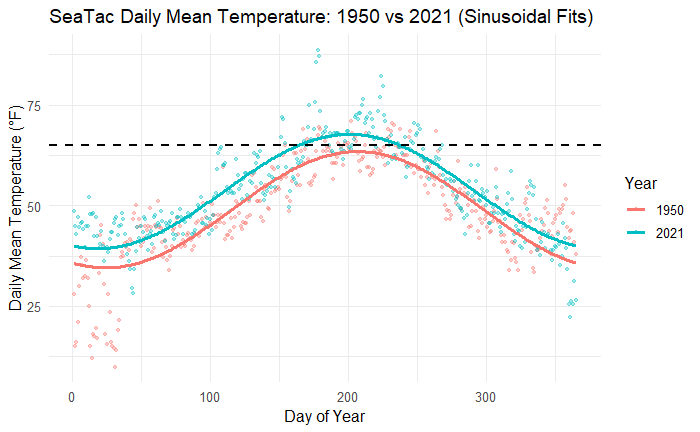

---
output:
  word_document: default
  html_document: default
---
# Applications of Integration: Interpreting Environmental and Biological Systems

---


## Application 1: Carbon Sequestration in a Restored Wetland  
### Objective {-}
Use integration to calculate **net carbon storage** by combining carbon uptake and carbon loss over time.

### Scenario {-}
Wetlands remove carbon from the atmosphere through plant growth and long-term biomass accumulation, but they also release carbon through respiration and decomposition. Net carbon storage depends on the balance between these competing processes.

Following wetland restoration, carbon uptake typically **increases over time** as vegetation establishes, while carbon loss may be initially elevated due to decomposition of disturbed soils and organic matter, before settling into a **long-term steady rate** tied to ongoing ecosystem respiration.

### Models {-}

Let \( t \) be time in **years**.

#### Carbon Uptake {-}
\[
U(t) = A\left(1 - e^{-kt}\right)
\]

where:

- \(A = 5\) kg C/year is the long-term maximum uptake rate,  
- \(k = 0.4\ \text{yr}^{-1}\) controls how quickly uptake approaches that maximum.

This model represents vegetation establishment: uptake is initially low, increases rapidly, and then levels off as the ecosystem matures.


#### Carbon Loss {-}
\[
L(t) = L_{\infty} + \big(B - L_{\infty}\big)e^{-mt}
\]
where:

- \(B = 3\) kg C/year is the initial carbon loss rate immediately after restoration,  
- \(L_{\infty} = 1\) kg C/year is the long-term steady-state loss rate,  
- \(m = 0.2\ \text{yr}^{-1}\) controls how quickly losses decline toward equilibrium.

This model reflects early decomposition of disturbed organic matter followed by persistent baseline respiration and decomposition that does not disappear over time.


### Net Carbon Storage {-}

The **net rate of carbon storage** is given by:
\[
N(t) = U(t) - L(t)
\]

The **total carbon stored** over a period of time is found by integrating this difference:
\[
\text{Net carbon storage} = \int_0^T \big(U(t) - L(t)\big)\,dt
\]

A positive value indicates net sequestration, while a negative value indicates the wetland is acting as a carbon source.


```{r, warning=FALSE,echo=FALSE, message=FALSE}
# ---------------------------------------------
# Carbon Uptake and Loss Models (Annual scale)
# ---------------------------------------------

# Parameters
A  <- 5     # kg C / year (maximum uptake rate)
k  <- 0.4   # uptake rate (1/year)

B  <- 3     # kg C / year (initial loss rate)
L_inf <- 1  # kg C / year (steady-state loss rate)
m  <- 0.2   # loss decay rate (1/year)

# Time vector (years)
t <- seq(0, 20, by = 0.05)

# Models
U <- A * (1 - exp(-k * t))                       # Carbon uptake
L <- L_inf + (B - L_inf) * exp(-m * t)           # Carbon loss

# Plot
plot(
  t, U,
  type = "l",
  lwd = 2,
  col = "forestgreen",
  xlab = "Time (years)",
  ylab = "Carbon flux (kg C / year)",
  main = "Carbon Uptake and Loss in a Restored Wetland"
)

lines(
  t, L,
  lwd = 2,
  col = "firebrick"
)

# Legend
legend(
  "right",
  legend = c(
    "Uptake:  U(t) ",
    "Loss:    L(t) "
  ),
  col = c("forestgreen", "firebrick"),
  lwd = 2,
  bty = "n"
)

```

::: promptbox

**Prompt 1: Net Carbon Stored In First 2 Years**
\[
\text{Net Carbon} = \int_0^{2} \left[ U(t) - L(t) \right] dt
\]

1. Evaluate the integral.
2. Interpret the sign and magnitude of the result.
:::
::: promptbox
**Prompt 2: Net Carbon Stored Over 20 Years**

\[
\text{Net Carbon} = \int_0^{20} \left[ U(t) - L(t) \right] dt
\]

1. Evaluate the integral.
2. Interpret the sign and magnitude of the result.
:::

::: promptbox

**Prompt 3: Threshold Question**

1. Solve for the time \( t^* \) when \( U(t^*) = L(t^*) \).
2. Explain what this time represents ecologically.

:::


---

## Application 2: Fish Larval Recruitment  
### Objective  {-}
Use integration to calculate **total recruitment** by combining larval production with survival probability.


### Scenario {-}
Fish larvae are produced over a spawning season, but survival probability declines due to predation and environmental stress. Recruitment depends on both production and survival.

### Models {-}

Let \( t \) be time in **weeks**.

#### Larval Production Rate {-}
\[
P(t) = P_0 t
\]
where:

- \(P_0 = 1000\) larvae/week\(^2\)

#### Survival Probability {-}
\[
S(t) = e^{-kt}
\]
where:

- \(k = 0.5\)


::: promptbox

**Prompt 1: Total Recruitment**
\[
R = \int_0^{8} P(t) S(t)\,dt
\]

1. Evaluate the integral.
2. Interpret the result biologically.

:::
::: promptbox
**Prompt 2: Interpretation**

1. Why must production and survival be multiplied?
2. When does recruitment contribute most strongly?
3. Why might late-season spawning be less effective?

:::

---

## Application 3: Drug Absorption and Metabolism

### Objective {-}
Use integration to calculate **total drug exposure** and compare how different absorption models influence **how quickly a drug takes effect** and **how long it remains active**.


### Scenario {-}
Pharmacologists study how drugs enter the bloodstream and are metabolized over time. The concentration of a drug in the blood determines its effectiveness and potential side effects.

Let \(t\) be time in **hours**, and let \(C(t)\) be concentration in (for example) **mg/L**.


## Models {-}

### Model 1: Immediate Absorption with Decay (fast spike, then decline)  {-}
\[
C_1(t) = C_0 e^{-kt}
\]
where:

- \(C_0 = 20\) (initial concentration, mg/L),
- \(k = 0.8\ \text{hr}^{-1}\) (metabolic removal rate).

```{r, warning=FALSE,echo=FALSE, message=FALSE}
# ---------------------------------------------
# Plot C1(t) = C0 * exp(-k t)
# ---------------------------------------------

# Parameters
C0 <- 20        # initial concentration (mg/L)
k  <- 0.8      # metabolic removal rate (1/hr)

# Time vector (hours)
t <- seq(0, 24, by = 0.1)

# Concentration function
C1 <- C0 * exp(-k * t)

# Plot
plot(
  t, C1,
  type = "l",
  lwd = 2,
  xlab = "Time (hours)",
  ylab = "Drug concentration (mg/L)",
  main = expression(C[1](t) == 20* e^{-0.8 * t})
)

```

**Interpretation:** The drug enters the bloodstream essentially all at once, then is removed exponentially.


### Model 2: Gradual Absorption with Decay (delayed rise, then decline)  {-}
\[
C_2(t) = t e^{-kt}
\]
where:

- \(k = 0.2\ \text{hr}^{-1}\).

```{r, warning=FALSE,echo=FALSE, message=FALSE}

# ---------------------------------------------
# Plot C2(t) = t * exp(-k t)
# ---------------------------------------------

# Parameter
k <- 0.2    # metabolic removal rate (1/hr)

# Time vector (hours)
t <- seq(0, 24, by = 0.1)

# Concentration function
C2 <- t * exp(-k * t)

# Plot
plot(
  t, C2,
  type = "l",
  lwd = 2,
  xlab = "Time (hours)",
  ylab = "Drug concentration (mg/L)",
  main = expression(C[2](t) == t * e^{-0.2 * t})
)
```

**Interpretation:** Concentration rises at first as absorption increases, but eventually decay dominates and concentration falls.


::: promptbox
**Prompt 1: Total Drug Exposure (Area Under the Curve)**
A common measure of “how much drug the body experiences” is the **area under the concentration curve**, often called **total exposure**:

\[
\text{Total Exposure} = \int_0^{24} C(t)\,dt
\]

1. Evaluate the integral for Model 1:
   \[
   \int_0^{24} C_1(t)\,dt
   \]
2. Evaluate the integral for Model 2:
   \[
   \int_0^{24} C_2(t)\,dt
   \]
3. The two results should be close-ish to each other. Comment on this finding.


:::
::: promptbox
**Prompt 2**

- Which model produces a larger area under the curve on \([0,24]\)?
- How does the shape of the curve influence the area?
- Redo the analysis but this time compare the drug exposure over the first four hours. Comment on your results.

:::


---


## Application 4: Understanding Energy Demand in a Warming Pacific Northwest

Understanding changes in energy use—and anticipating future energy demand—is a growing concern in the Pacific Northwest. Energy systems in this region have historically been designed around relatively mild summers and cool, wet winters. As temperatures shift, both **heating** and **cooling** needs are changing in ways that matter for infrastructure planning, energy equity, and climate resilience.

To explore this, we will compare temperature patterns from **1950**, one of the earliest years with extensive temperature records, to **2021**, one of the hottest years on record. This comparison allows us to see not just *that* temperatures have changed, but *how* those changes translate into energy demand.

The figure below is the mean daily temperate for Seattle calculated as the average of the max and min daily temperature.

{fig.cap="" fig.alt="Temperature profile" style="float=center; width:650px; margin:10px;"}
Fitting a sinusoid to the daily data yields the following equaitons:

\[
T_{1950}(d) = 14.43\,\sin\!\left(\frac{2\pi d}{365} - 1.99\right) + 49.02
\]

\[
T_{2021}(d) = 14.20\,\sin\!\left(\frac{2\pi d}{365} - 1.89\right) + 53.55
\]

*Note: Data plotted from SEATAC daily normals dataset*

::: promptbox
**Prompt 1: Data Observation**

- How would you characterize the difference between the daily data points in these two years?
- Do you think the sinusoids capture the trend of the data?
- Calculate the area between these two curves
- The units of the area you calculate will be degree days - try to interpret that.


:::


## Heating and Cooling Degree Days {-}

To connect temperature patterns to energy use, we use two related measures:

- **Heating Degree Days (HDD)**
- **Cooling Degree Days (CDD)**

Both are based on comparing observed temperatures to a fixed **baseline temperature**, commonly **65°F**, which represents a typical indoor comfort threshold.


## The Basic Idea Behind Degree Days {-}

Think of degree days as a way of measuring **how much** and **for how long** temperatures deviate from the baseline.

### Cooling Degree Days (CDD) {-}

Cooling Degree Days measure the demand for air conditioning.

1. Start with a baseline temperature of 65°F.
2. Look at how much the temperature rises *above* 65°F.
3. Accumulate that excess over time.

Conceptually:

- If the temperature is just a little above 65°F for many days, CDD increases.
- If the temperature is far above 65°F for a shorter time, CDD can also increase significantly.

Mathematically, this is an example of **integrating under a curve**, where we measure the *area between the temperature curve and the baseline* when the curve is above 65°F.

::: promptbox
**Prompt 2: CDD**

- For 1950 what do you observe as the cooling degree days
- For 2021 set up the integral the calculates the area between the temperature curve and the baseline
  - You will need to work out the bounds of integration [Hint: Find the days where the 2021 Temperature function =65]
  - Calculate the CDD for 2021

:::


### Heating Degree Days (HDD) {-}

Heating Degree Days measure the demand for heating.

1. Again, use 65°F as the baseline.
2. Look at how much the temperature falls *below* 65°F.
3. Accumulate that deficit over time.

Here, we measure the area between the baseline and the temperature curve when the curve is below 65°F.

::: promptbox
**Prompt 3: HDD**

- For 1950 and 2021 set up the integral the calculates the area between the temperature curve and the baseline
- Compare the HDD from both years and make a brief comment

:::

::: promptbox
**Prompt 4: Can you do better?**

- For each year calculate the CDD+HDD
  - Which year required more energy?
  - Comment
  
- Rather than fitting a function and integrating - what other integration technique could we use?
  - Briefly describe how you would use this technique.
  
- Dig deeper - This metric was developed around the 1950s (before we had air conditioning and smart thermostats)
  - Do you agree with this metric?
  - How could you tweak this analysis to get a better picture of present day energy usage?

:::


```{r, echo=FALSE, warning=FALSE, message=FALSE}
# # ============================================================
# # SeaTac temperature comparison: 1950 vs 2021
# # - Reads NOAA-style daily data from seatac_data.csv
# # - Plots daily MAX temp + sinusoidal fit for 1950 and 2021
# # - Plots daily MIN temp + sinusoidal fit for 1950 and 2021
# # - Plots daily MEAN temp (max+min)/2 + sinusoidal fit for 1950 and 2021
# #
# # Notes:
# # - NOAA daily temps in this file are in tenths of °C (common GHCN format).
# # - Convert to °F: (C * 9/5) + 32, where C = value/10
# # - Sinusoid fit uses: T(d) = a*sin(2πd/365) + b*cos(2πd/365) + c
# #   then converts to amplitude/phase form.
# # ============================================================
# 
# library(tidyverse)
# library(lubridate)
# 
# # ----------------------------
# # 1) Read in the data
# # ----------------------------
# file_path <- "seatac_data.csv"
# 
# raw <- read_csv(file_path, show_col_types = FALSE)
# 
# # Helper: tenths of °C -> °F
# to_F <- function(x_tenthsC) {
#   (x_tenthsC / 10) * 9/5 + 32
# }
# 
# # Parse dates + compute daily max/min/mean in °F
# # (Require both TMAX and TMIN for mean; allow TMAX-only for max plot, etc.)
# dat <- raw %>%
#   mutate(
#     DATE = mdy(DATE),
#     year = year(DATE),
#     doy  = yday(DATE),
#     tmax_F = if_else(!is.na(TMAX), to_F(TMAX), NA_real_),
#     tmin_F = if_else(!is.na(TMIN), to_F(TMIN), NA_real_),
#     tmean_F = if_else(!is.na(TMAX) & !is.na(TMIN), to_F((TMAX + TMIN) / 2), NA_real_)
#   ) %>%
#   filter(year %in% c(1950, 2021))
# 
# # ----------------------------
# # 2) Sinusoidal fit function
# # ----------------------------
# # Fit: T(d) = a*sin(w d) + b*cos(w d) + c, w = 2π/365
# # Return coefficients + a tidy prediction dataframe for plotting.
# fit_sinusoid <- function(df_year, value_col) {
#   w <- 2 * pi / 365
# 
#   # Keep complete cases for the chosen variable
#   d <- df_year %>%
#     select(doy, value = all_of(value_col)) %>%
#     filter(!is.na(value))
# 
#   # Linear regression in sin/cos basis
#   fit <- lm(value ~ sin(w * doy) + cos(w * doy), data = d)
# 
#   coefs <- coef(fit)
#   c0 <- unname(coefs[1])
#   a  <- unname(coefs[2])
#   b  <- unname(coefs[3])
# 
#   # Convert to amplitude/phase: a*sin + b*cos = A*sin(w d + phi)
#   A   <- sqrt(a^2 + b^2)
#   phi <- atan2(b, a)  # radians
# 
#   # Prediction grid across a full year
#   grid <- tibble(doy = 1:365) %>%
#     mutate(
#       pred = c0 + a * sin(w * doy) + b * cos(w * doy)
#     )
# 
#   list(
#     fit = fit,
#     params = tibble(A = A, phi = phi, C = c0),
#     grid = grid
#   )
# }
# 
# # ----------------------------
# # 3) Plot helper (daily dots + fitted curve)
# # ----------------------------
# plot_daily_with_fit <- function(df, value_col, y_label, title_text) {
#   # Fit per year
#   fits <- df %>%
#     group_split(year) %>%
#     set_names(map_chr(., ~ as.character(unique(.x$year)))) %>%
#     map(~ fit_sinusoid(.x, value_col))
# 
#   # Build prediction dataframe with year column
#   pred_df <- imap_dfr(fits, ~ .x$grid %>% mutate(year = as.integer(.y)))
# 
#   # Optional: print equations to console (nice for copying into notes)
#   # T(d) = A sin(2π d/365 + phi) + C
#   eqs <- imap_dfr(fits, ~ {
#     p <- .x$params
#     tibble(
#       year = as.integer(.y),
#       A = p$A,
#       phi = p$phi,
#       C = p$C,
#       equation = sprintf("T(d) = %.2f * sin(2π d/365 + %.2f) + %.2f", A, phi, C)
#     )
#   })
#   print(eqs)
# 
#   ggplot(df, aes(x = doy, y = .data[[value_col]], group = factor(year))) +
#     geom_point(aes(color = factor(year)), alpha = 0.35, size = 0.9) +
#     geom_line(
#       data = pred_df,
#       aes(x = doy, y = pred, color = factor(year)),
#       linewidth = 1.1
#     ) +
#     labs(
#       x = "Day of Year",
#       y = y_label,
#       color = "Year",
#       title = title_text
#     ) +
#     theme_minimal(base_size = 12)
# }
# 
# # ----------------------------
# # 4) Plot DAILY MAX for 1950 and 2021 + fits
# # ----------------------------
# p_max <- plot_daily_with_fit(
#   df = dat,
#   value_col = "tmax_F",
#   y_label = "Daily Maximum Temperature (°F)",
#   title_text = "SeaTac Daily Maximum Temperature: 1950 vs 2021 (Sinusoidal Fits)"
# )
# print(p_max)
# 
# # ----------------------------
# # 5) Plot DAILY MIN for 1950 and 2021 + fits
# # ----------------------------
# p_min <- plot_daily_with_fit(
#   df = dat,
#   value_col = "tmin_F",
#   y_label = "Daily Minimum Temperature (°F)",
#   title_text = "SeaTac Daily Minimum Temperature: 1950 vs 2021 (Sinusoidal Fits)"
# )
# print(p_min)
# 
# # ----------------------------
# # 6) Plot DAILY MEAN ( (max+min)/2 ) for 1950 and 2021 + fits
# # ----------------------------
# p_mean <- plot_daily_with_fit(
#   df = dat,
#   value_col = "tmean_F",
#   y_label = "Daily Mean Temperature (°F)",
#   title_text = "SeaTac Daily Mean Temperature: 1950 vs 2021 (Sinusoidal Fits)"
# ) +
#   geom_hline(
#     yintercept = 65,
#     linetype = "dashed",
#     linewidth = 0.9,
#     color = "black"
#   )
# 
# print(p_mean)


# ----------------------------
# (Optional) Save plots
# ----------------------------
# ggsave("seatac_tmax_1950_2021.png", p_max, width = 9, height = 5, dpi = 200)
# ggsave("seatac_tmin_1950_2021.png", p_min, width = 9, height = 5, dpi = 200)
# ggsave("seatac_tmean_1950_2021.png", p_mean, width = 9, height = 5, dpi = 200)


```

---

## Application 5: Estimating the Number of Fish Off the Coast  

### Objective {-}
Use a triple integral to calculate the **total number of fish** in a region of ocean by integrating a **3D density function** over a volume.

### Scenario {-}
Marine ecologists often estimate fish populations using sonar surveys and net sampling. These measurements can be used to build a **fish density model** that varies with location and depth.

For example, fish might be:

- more abundant near the continental shelf than far offshore,
- concentrated in a band of depths where temperature and oxygen are favorable,
- patchy due to schooling behavior.

A **density function** allows us to model how many fish exist *per unit volume* of water.

---

### Models {-}

Let \(\rho(x,y,z)\) be fish density in **fish per km\(^3\)**.

- \(x\) = offshore distance (km)  
- \(y\) = along-coast distance (km)  
- \(z\) = depth below the surface (km), so \(z \ge 0\)

We will estimate the total fish population in a rectangular survey box:

\[
0 \le x \le 20,\qquad 0 \le y \le 50,\qquad 0 \le z \le 0.3
\]

This corresponds to:

- 20 km offshore,
- 50 km along the coast,
- down to 300 m depth.

---

### Fish Density Model {-}

A simple model capturing these ideas is:

\[
\rho(x,y,z)
= \rho_0\,e^{-0.05x}\,\left(1 + 0.01y\right)\,e^{-30(z-0.1)^2}
\]

where:

- \(\rho_0 = 200\) fish/km\(^3\) is a baseline density scale,
- \(e^{-0.05x}\) models declining density offshore,
- \((1+0.01y)\) models a gradual along-coast gradient,
- \(e^{-30(z-0.1)^2}\) concentrates fish near 100 m depth.

```{r, echo=FALSE, warning=FALSE, message=FALSE}

# ============================================================
# Fish density model and three-panel visualization
# ============================================================

# ---------------------------------------------
# Parameters
# ---------------------------------------------
rho0 <- 200   # baseline density (fish per km^3)

# ---------------------------------------------
# Fish density function rho(x, y, z)
# ---------------------------------------------
# x = offshore distance (km)
# y = along-coast distance (km)
# z = depth below surface (km)

rho <- function(x, y, z) {
  rho0 *
    exp(-0.05 * x) *
    (1 + 0.01 * y) *
    exp(-30 * (z - 0.1)^2)
}

# ---------------------------------------------
# Create vectors for each dimension
# ---------------------------------------------
x <- seq(0, 20, by = 0.1)   # offshore distance (km)
y <- seq(0, 50, by = 0.5)   # along-coast distance (km)
z <- seq(0, 0.3, by = 0.005) # depth (km)

# Hold two variables fixed while varying the third
# Reference location: x = 5 km, y = 10 km, z = 0.1 km
rho_x <- rho(x = x, y = 10, z = 0.1)
rho_y <- rho(x = 5, y = y, z = 0.1)
rho_z <- rho(x = 5, y = 10, z = z)

# ---------------------------------------------
# Three-panel plot
# ---------------------------------------------
par(mfrow = c(1, 3), mar = c(4, 4, 3, 1))

# Panel 1: Offshore distance
plot(
  x, rho_x,
  type = "l",
  lwd = 2,
  col = "steelblue",
  xlab = "Offshore distance (km)",
  ylab = "Fish density (fish / km^3)",
  main = "Density vs Offshore Distance"
)

# Panel 2: Along-coast distance
plot(
  y, rho_y,
  type = "l",
  lwd = 2,
  col = "darkorange",
  xlab = "Along-coast distance (km)",
  ylab = "",
  main = "Density vs Along-Coast Position"
)

# Panel 3: Depth
plot(
  z, rho_z,
  type = "l",
  lwd = 2,
  col = "forestgreen",
  xlab = "Depth (km)",
  ylab = "",
  main = "Density vs Depth"
)

# Reset plotting layout
par(mfrow = c(1, 1))
```

::: promptbox

**Prompt 1

The three panels above describe how the density of fish vary in the x,y and z. 

- In simple terms explain the trends you are seeing.
- Iterpret these graphs to estimate roughly where the highest density would be (give  a rough x,y,z location)

:::

To help you visulize this density expression, these are 4 slices of density at 4 different depths.

```{r, echo=FALSE, warning=FALSE, message=FALSE}
# ============================================================
# Four-panel visualization of fish density at fixed depths
# ============================================================

library(tidyverse)

# ---------------------------------------------
# Fish density function
# ---------------------------------------------
rho0 <- 200

rho <- function(x, y, z) {
  rho0 *
    exp(-0.05 * x) *
    (1 + 0.01 * y) *
    exp(-30 * (z - 0.1)^2)
}

# ---------------------------------------------
# Create x-y grid
# ---------------------------------------------
x_vals <- seq(0, 20, by = 0.25)
y_vals <- seq(0, 50, by = 0.5)

# Depths in km (0 m, 100 m, 200 m, 300 m)
depths_km <- c(0.0, 0.1, 0.2, 0.3)

# Build dataset
grid <- expand.grid(
  x = x_vals,
  y = y_vals,
  z = depths_km
) %>%
  as_tibble() %>%
  mutate(
    density = rho(x, y, z),
    depth_label = factor(
      z,
      levels = c(0.0, 0.1, 0.2, 0.3),
      labels = c(
        "Depth = 0 m",
        "Depth = 100 m",
        "Depth = 200 m",
        "Depth = 300 m"
      )
    )
  )

# ---------------------------------------------
# Global color limits (shared across panels)
# ---------------------------------------------
dens_limits <- range(grid$density)

# ---------------------------------------------
# Four-panel plot (ordered)
# ---------------------------------------------
ggplot(grid, aes(x = x, y = y, fill = density)) +
  geom_raster() +
  geom_contour(aes(z = density), color = "white", alpha = 0.5) +
  facet_wrap(~ depth_label, ncol = 2) +
  scale_fill_viridis_c(
    limits = dens_limits,
    name = "Fish density\n(fish / km³)"
  ) +
  labs(
    title = "Fish Density at Four Depths",
    x = "Offshore distance (km)",
    y = "Along-coast distance (km)"
  ) +
  theme_minimal(base_size = 12)


```

## Total Number of Fish {-}

The total number of fish in the region is the integral of density over volume:

\[
N=\iiint_V \rho(x,y,z)\,dV
\]

In rectangular coordinates, \(dV = dx\,dy\,dz\), so:

\[
N=\int_{0}^{20}\int_{0}^{50}\int_{0}^{0.3}
\rho(x,y,z)\,dz\,dy\,dx
\]

---

::: promptbox
**Prompt 1: Units Check**

1. What are the units of \(\rho(x,y,z)\)?
2. What are the units of \(dV\)?
3. Explain why the triple integral has units of **fish**.

:::

::: promptbox
**Prompt 2: Set Up the Triple Integral**

Evaluate the integral below to calculate the total number of fish in this domain,

\[
N=\int_{0}^{20}\int_{0}^{50}\int_{0}^{0.3}
200\,e^{-0.05x}\,(1+0.01y)\,e^{-30(z-0.1)^2}\;dz\,dy\,dx
\]

:::

::: promptbox
**Prompt 3: Layers**

1. Write the integral and evaluate it to find the total number of fish in the top 100m of the water collumn.

2. Write the integral and evaluate it to find the total number of fish in the region between the shore and 1km out.


:::

---

